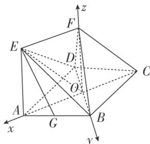

> [!faq]- 《专题11 利用空间向量计算2面角的问题-立体几何（理科）》例题解析
>
> > [!success]- **【答案】** 详见解析
>
> > [!note]- **【解析】**
> > 解析
> > (1) 设 $AC \cap BD = O$ ，连接 OE，OF，
> >
> > ∵CF//平面BDE，CF⊂平面AEFC，平面AEFC∩平面BDE=OE，∴OE//CF，
> >
> > 又 $EF \parallel AC$ ，∴四边形 EOCF 是平行四边形，∴EF = OC.
> >
> > ∵四边形 ABCD 是菱形，∴OA=OC，∴EF=OA=OC.
> >
> > 又 $EF \parallel AC$ ，∴四边形EFOA是平行四边形，
> >
> > ∴OF//EA，∵EA⊥平面ABCD，∴OF⊥平面ABCD.
> >
> > 设 OA=a, OB=b, AE=c,
> >
> > 
> >
> > 以 O 为坐标原点，OA，OB，OF 所在直线分别为 x 轴、y 轴、z 轴，建立空间直角坐标系，
> >
> > 则 $E(a, 0, c)$ , $G\left(\frac{a}{2}, \frac{b}{2}, 0\right)$ , $B(0, b, 0)$ , $C(-a, 0, 0)$ , $F(0, 0, c)$ ,
> >
> > $$
> > \vec {F B} = (0, b, - c), \vec {F C} = (- a, 0, - c), \vec {E G} = \left[ - \frac {a}{2}, \frac {b}{2}, - c \right],
> > $$
> >
> > 设平面BCF的法向量为 $\nu = (x, y, z)$ ，则 $\left\{ \begin{array}{l} \nu \overrightarrow{FB} = by - cz = 0, \\ \nu \overrightarrow{FC} = -ax - cz = 0, \end{array} \right.$ 取 $z = b$ ，得 $\nu = \left[ -\frac{bc}{a}, c, b \right]$ ， $\because \nu \overrightarrow{EG} = \left[ -\frac{a}{2} \right] \cdot \left[ -\frac{bc}{a} \right] + \frac{b}{2} c + (-c) \cdot b = 0$ ，又 $EG \nparallel$ 平面BCF， $\therefore EG \parallel$ 平面BCF.  
> > (2)设 $AE = AB = 2$ ， $\because \angle BAD = 60^\circ$ ， $\therefore OB = 1$ ， $OA = \sqrt{3}$ ，由
> > (1)中建立的空间直角坐标系，可得 $A(\sqrt{3}, 0, 0)$ ， $B(0, 1, 0)$ ， $E(\sqrt{3}, 0, 2)$ ， $D(0, -1, 0)$ ， $\therefore \overrightarrow{BE} = (\sqrt{3}, -1, 2)$ ， $\overrightarrow{BA} = (\sqrt{3}, -1, 0)$ ， $\overrightarrow{BD} = (0, -2, 0)$ ，设平面ABE的法向量 $n = (x_1, y_1, z_1)$ ，则 $\left\{ \begin{array}{l} n \cdot \overrightarrow{BA} = \sqrt{3} x_1 - y_1 = 0, \\ n \cdot \overrightarrow{BE} = \sqrt{3} x_1 - y_1 + 2z_1 = 0, \end{array} \right.$ 取 $x_1 = 1$ ，得 $n = (1, \sqrt{3}, 0)$ ，设平面BDE的法向量 $m = (x_2, y_2, z_2)$ ，则 $\left\{ \begin{array}{l} m \cdot \overrightarrow{BE} = \sqrt{3} x_2 - y_2 + 2z_2 = 0, \\ m \cdot \overrightarrow{BD} = -2y_2 = 0, \end{array} \right.$ 取 $x_2 = 2$ ，得 $m = (2, 0, -\sqrt{3})$ ，设二面角 $A - BE - D$ 的平面角为 $\theta$ ，则 $\cos \theta = \frac{|m \cdot n|}{|m||n|} = \frac{2}{\sqrt{7} \times \sqrt{4}} = \frac{\sqrt{7}}{7}$ . $\therefore$ 二面角 $A - BE - D$ 的余弦值为 $\frac{\sqrt{7}}{7}$ .
