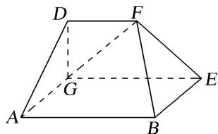

<!-- question-source:start -->
1. 在如图所示的多面体中，四边形 $ABEG$ 是矩形，梯形 $DGEF$ 为直角梯形，平面 $DGEF \perp$ 平面 $ABEG$ ，且 $DG \perp GE$ ， $DF \parallel GE$ ， $AB = 2AG = 2DG = 2DF = 2$ .

(1)求证： $FG \perp$ 平面 BEF.

(2)求二面角 A-BF-E 的大小.

<!-- question-source:end -->

![[高中/总复习/专题/立体几何/专题11 利用空间向量计算2面角的问题-立体几何（理科）/考点03_不规则几何体模型/对点训练/answers/Q00043764A1.md]]
