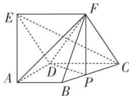

<!-- question-source:start -->
3. 如图，在五面体 $ABCDEF$ 中，底面 $ABCD$ 是直角梯形， $AB \parallel CD$ ， $AD \perp CD$ ，侧面 $CDEF$ 是菱形， $\angle DCF = 60^\circ$ ， $CD = 2AD = 2AB$ ， $AE = \sqrt{5} AD$ .

(1)证明： $CE \perp AF;$

(2)已知点 P 在线段 BC 上，且 $CP=\lambda CB$ ，若二面角 A-DF-P 的大小为 $60^{\circ}$ ，求实数 $\lambda$ 的值.

<!-- question-source:end -->

![[高中/总复习/专题/立体几何/专题11 利用空间向量计算2面角的问题-立体几何（理科）/考点03_不规则几何体模型/对点训练/answers/Q00043766A1.md]]
