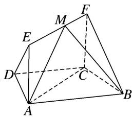

<!-- question-source:start -->
4. 如图所示，在梯形 $ABCD$ 中， $AB \parallel CD$ ， $\angle BCD = 120^{\circ}$ ，四边形 $ACFE$ 为矩形，且 $CF \perp$ 平面 $ABCD$ ， $AD = CD = BC = CF$ .

(1)求证： $EF \perp$ 平面 BCF;

(2)点 M 在线段 EF 上运动，设平面 MAB 与平面 FCB 的夹角为 $\theta$ ，试求 $\cos\theta$ 的取值范围.

<!-- question-source:end -->

![[高中/总复习/专题/立体几何/专题11 利用空间向量计算2面角的问题-立体几何（理科）/考点03_不规则几何体模型/对点训练/answers/Q00043767A1.md]]
