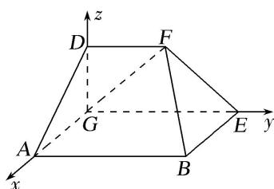

> [!faq]- 《专题11 利用空间向量计算2面角的问题-立体几何（理科）》例题解析
>
> > [!success]- **【答案】** 详见解析
>
> > [!note]- **【解析】**
> > 解析
> > (1)∵平面 $DGEF \perp$ 平面 ABEG，且 $BE \perp GE$ ，∴ $BE \perp$ 平面 DGEF.
> >
> > 又 $FG \subset$ 平面 $DGEF$ , $\therefore BE \perp FG$ . 由题意得 $FG = FE = \sqrt{2}$ , $\therefore FG^2 + FE^2 = GE^2$ , 则 $FE \perp FG$ . 又 $BE$ , $EF$ 是平面 $BEF$ 内的两条相交直线. 故 $FG \perp$ 平面 $BEF$ .
> >
> > (2)如图所示，建立空间直角坐标系，则 $A(1,0,0),B(1,2,0),E(0,2,0),F(0,1,1)$ $\overrightarrow{FA} = (1, - 1, - 1),\overrightarrow{FB} = (1,1, - 1),\overrightarrow{FE} = (0,1, - 1).$
> >
> > 
> >
> > 设平面 AFB 的法向量为 $\boldsymbol{n}=(x_{1},y_{1},z_{1})$ ，则 $\left\{\begin{aligned}\overrightarrow{FA}\cdot\boldsymbol{n}&=0,\\ \overrightarrow{FB}\cdot\boldsymbol{n}&=0\end{aligned}\right.\Rightarrow\left\{\begin{aligned}x_{1}-y_{1}-z_{1}&=0,\\ x_{1}+y_{1}-z_{1}&=0\end{aligned}\right.\Rightarrow\left\{\begin{aligned}x_{1}&=z_{1},\\ y_{1}&=0.\end{aligned}\right.$
> >
> > $$
> > x _ {1} = 1, \quad n = (1, 0, 1)
> > $$
> >
> > 由
> > (1)可知平面 EFB 的法向量为 $\boldsymbol{m}=\overrightarrow{GF}=(0,1,1)$ .
> >
> > ∴ $\cos <n,\quad m>=\frac{n\cdot m}{|n||m|}=\frac{1}{\sqrt{2}\times\sqrt{2}}=\frac{1}{2}$ ，因此两平面法向量的夹角为 $\frac{\pi}{3}$ ,
> >
> > 由图可知，二面角 $A - BF - E$ 为钝二面角，所以二面角 $A - BF - E$ 的大小为 $\frac{2\pi}{3}$ .
