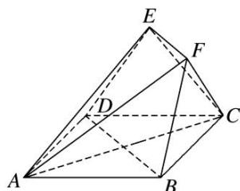
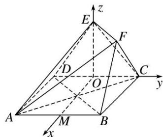

> [!faq]- 《专题11 利用空间向量计算2面角的问题-立体几何（理科）》例题解析
>
> > [!success]- **【答案】** 详见解析
>
> > [!note]- **【分析】**
> > 本题未单列分析。
>
> > [!note]- **【解析】**
> > (1)证明：平面 $ABCD \perp$ 平面 $EDC$ ;
> >
> > (2)求平面 AEF 与平面 EDC 所成锐二面角的余弦值.
> >
> > 
> >
> > 2. 解析
> > (1) $\because AB = AD = 2, AE = 3, DE = \sqrt{5}, \therefore AD^2 + DE^2 = AE^2, \therefore AD \perp DE,$ 又正方形ABCD中， $AD \perp DC$ ，且 $DE \cap DC = D, DE, DC \subset$ 平面EDC， $\therefore AD \perp$ 平面EDC，又 $\because AD \subset$ 平面ABCD，∴平面ABCD⊥平面EDC.
> > (2)由
> > (1)知， $\angle EDC$ 是二面角 $E - AD - C$ 的平面角，作 $OE \perp CD$ 于 $O$ ，则 $OD = DE \cdot \cos \angle EDC = 1, OE = 2,$ 又 $\because$ 平面ABCD⊥平面EDC，平面ABCD∩平面 $EDC = CD, OE \subset$ 平面EDC，∴ $OE \perp$ 平面ABCD.取 $AB$ 中点 $M$ ，连接 $OM$ ，则 $OM \perp CD$ ，如图，以 $O$ 为原点，分别以 $OM, OC, OE$ 所在直线为 $x$ 轴、 $y$ 轴、 $z$ 轴，建立空间直角坐标系，
> >
> > 
> >
> > 则 $A(2, -1, 0)$ ， $B(2, 1, 0)$ ， $D(0, -1, 0)$ ， $E(0, 0, 2)$ ， $\therefore \overrightarrow{AE}=(-2, 1, 2)$ ， $\overrightarrow{BD}=(-2, -2, 0)$ ，又 $EF \parallel BD$ ，知 EF 的一个方向向量为 $(2, 2, 0)$ ，
> >
> > 设平面 AEF 的法向量为 $\boldsymbol{n}=(x,y,z)$ ，则 $\left\{\begin{aligned}\boldsymbol{n}\cdot\overrightarrow{AE}&=-2x+y+2z=0,\\ \boldsymbol{n}\cdot\overrightarrow{DB}&=2x+2y=0,\end{aligned}\right.$ 取 x=-2，得 $\boldsymbol{n}=(-2,2,-3)$ ，
> > 又平面 EDC 的一个法向量为 $\boldsymbol{m}=(1,0,0)$ , $\therefore\cos<n,\quad m>\frac{n\cdot m}{|n|\cdot|m|}=-\frac{2\sqrt{17}}{17}$ 设平面 AEF 与平面 EDC 所成的锐二面角为 $\theta$ ，则 $\cos\theta=|\cos<n,\quad m>|\frac{2\sqrt{17}}{17}$ .
