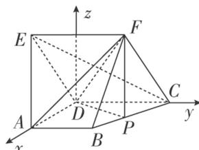

> [!faq]- 《专题11 利用空间向量计算2面角的问题-立体几何（理科）》例题解析
>
> > [!success]- **【答案】** 详见解析
>
> > [!note]- **【分析】**
> > 本题未单列分析。
>
> > [!note]- **【解析】**
> > (1)证明： $CE \perp AF;$
> >
> > (2)已知点 P 在线段 BC 上，且 $CP=\lambda CB$ ，若二面角 A-DF-P 的大小为 $60^{\circ}$ ，求实数 $\lambda$ 的值.
> >
> > 
> >
> > 3. 解析
> > (1)∵侧面 CDEF 是菱形，CD=2AD，∴DE=CD=2AD，CE⊥DF.
> > ∵AE= $\sqrt{5}$ AD, ∴AE $^{2}$ =AD $^{2}$ +DE $^{2}$ =5AD $^{2}$ , ∴AD⊥DE.
> > ∵AD⊥CD, CD∩DE=D, ∴AD⊥平面 CDEF, ∴AD⊥CE.
> > 又 DF∩AD=D, ∴CE⊥平面 ADF, ∴CE⊥AF.
> >
> > (2)以 D 为坐标原点，DA，DC 所在直线分别为 x 轴、y 轴，建立如图所示的空间直角坐标系 Dxyz，
> >
> > 
> >
> > 设 DA=1，由题设可得 $D(0,0,0)$ ， $A(1,0,0)$ ， $B(1,1,0)$ ， $C(0,2,0)$ ， $E(0,-1,\sqrt{3})$ ， $F(0,1,\sqrt{3})$ ， $\overrightarrow{DF}=(0,1,\sqrt{3})$ ， $\overrightarrow{CB}=(1,-1,0)$ .
> > ∵ $\overrightarrow{CP} = \lambda \overrightarrow{CB} = (\lambda, -\lambda, 0)$ ，∴ $\overrightarrow{DP} = \overrightarrow{DC} + \overrightarrow{CP} = (\lambda, 2 - \lambda, 0)$ .
> > 设 m=(x,y,z) 是平面 DFP 的法向量，则 $\left\{\begin{aligned}&m\cdot\overrightarrow{DF}=y+\sqrt{3}z=0,\\ &m\cdot\overrightarrow{DP}=\lambda x+(2-\lambda)y=0,\end{aligned}\right.$ 令 z=-1，得 $m=\left(\sqrt{3}\left(1-\frac{2}{\lambda}\right),\sqrt{3},-1\right)$ ,
> > 由
> > (1)可知 $\overrightarrow{CE}=(0,-3,\sqrt{3})$ 是平面 ADF 的一个法向量，
> >
> > ∵二面角 A-DF-P 的大小为 $60^{\circ}$ ，∴ $\cos60^{\circ}=\frac{|m\cdot\overrightarrow{CE}|}{|m||\overrightarrow{CE}|}=\frac{|-4\sqrt{3}|}{2\sqrt{3}\times\sqrt{3\left(1-\frac{2}{\lambda}\right)^{2}+4}}=\frac{1}{2}$ ，解得 $\lambda=\frac{2}{3}$ .
