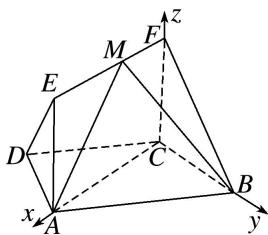

> [!faq]- 《专题11 利用空间向量计算2面角的问题-立体几何（理科）》例题解析
>
> > [!success]- **【答案】** 详见解析
>
> > [!note]- **【解析】**
> > 解析
> > (1) 设 $AD = CD = BC = 1$ , $\because AB // CD, \angle BCD = 120^\circ, \therefore AB = 2$ ,
> >
> > $\therefore AC^{2}=AB^{2}+BC^{2}-2AB\cdot BC\cdot\cos60^{\circ}=3,\quad\therefore AB^{2}=AC^{2}+BC^{2},\quad 则 BC\perp AC.$
> >
> > ∵四边形 ACFE 为矩形，∴AC⊥CF，而 CF，BC⊂平面 BCF，且 CF∩BC=C，
> >
> > ∴AC⊥平面BCF. ∵EF∥AC, ∴EF⊥平面BCF.
> >
> > (2)以 C 为坐标原点，分别以直线 CA, CB, CF 为 x 轴，y 轴，z 轴建立如图所示的空间直角坐标系，
> >
> > 
> >
> > 令 $FM = \lambda (0\leqslant \lambda \leqslant \sqrt{3})$ ，则 $C(0,0,0),A(\sqrt{3},0,0),B(0,1,0),M(\lambda ,0,1)$ 所以 $\overrightarrow{AB} = (-\sqrt{3},1,0),\overrightarrow{BM} = (\lambda , - 1,1),$
> >
> > 设 $\boldsymbol{n}_{1}=(x,y,z)$ 为平面 MAB 的一个法向量，由 $\left\{\begin{aligned}\boldsymbol{n}_{1}\cdot\overrightarrow{AB}&=0,\\ \boldsymbol{n}_{1}\cdot\overrightarrow{BM}&=0\end{aligned}\right.$ 得 $\left\{\begin{aligned}-\sqrt{3}x+y&=0,\\ \lambda x-y+z&=0,\end{aligned}\right.$ 取 x=1，所以 $\boldsymbol{n}_{1}=(1,\sqrt{3},\sqrt{3}-\lambda)$ ,
> >
> > 因为 $n_{2}=(1,0,0)$ 是平面 FCB 的一个法向量.
> >
> > 所以 $\cos \theta = \frac{|n_1 \cdot n_2|}{|n_1||n_2|} = \frac{1}{\sqrt{1 + 3 + (\sqrt{3} - \lambda)^2}} = \frac{1}{\sqrt{(\lambda - \sqrt{3})^2 + 4}}.$
> >
> > 因为 $0 \leqslant \lambda \leqslant \sqrt{3}$ ，所以当 $\lambda = 0$ 时， $\cos \theta$ 有最小值 $\frac{\sqrt{7}}{7}$ ，当 $\lambda = \sqrt{3}$ 时， $\cos \theta$ 有最大值 $\frac{1}{2}$ ，所以 $\cos \theta \in \left[\frac{\sqrt{7}}{7}, \frac{1}{2}\right]$ .
