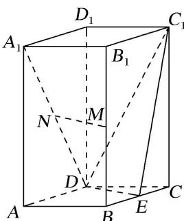

<!-- question-source:start -->
[例 1](2019·全国I)如图，直四棱柱 $ABCD-A_{1}B_{1}C_{1}D_{1}$ 的底面是菱形， $AA_{1}=4,\ AB=2,\ \angle BAD=60^{\circ}, E, M, N$ 分别是 BC, $BB_{1}, A_{1}D$ 的中点.

(1)证明： $MN \parallel$ 平面 $C_{1}DE$ ;

(2)求点 C 到平面 $C_{1}DE$ 的距离.

<!-- question-source:end -->

![[高中/总复习/专题/立体几何/专题11 立体几何中的点面距离问题-立体几何（文科）/专题11_立体几何中的点面距离问题/例题/answers/Q00043768A1.md]]
