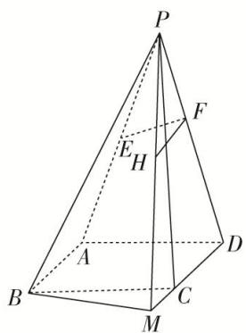

<!-- question-source:start -->
[例 2]如图，在四棱锥 P-ABCD 中，底面是边长为 2 的正方形， $PA=PD=\sqrt{17}$ ，E 为 PA 的中点，点 F 在 PD 上且 $EF\perp$ 平面 PCD，M 在 DC 延长线上， $FH\parallel DM$ ，交 PM 于点 H，且 FH=1.

(1)证明： $EF \parallel$ 平面 PBM;

(2)求点 M 到平面 ABP 的距离.

<!-- question-source:end -->

![[高中/总复习/专题/立体几何/专题11 立体几何中的点面距离问题-立体几何（文科）/专题11_立体几何中的点面距离问题/例题/answers/Q00043769A1.md]]
