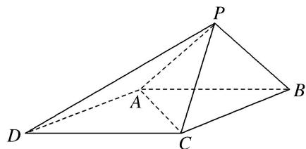

<!-- question-source:start -->
[例 3]如图，已知四棱锥 P-ABCD 的底面 ABCD 为菱形，且 $\angle ABC=60^{\circ}$ ，AB=PC=2，PA=PB= $\sqrt{2}$ .

(1)求证：平面 $PAB \perp$ 平面 $ABCD$ ;

(2)求点 D 到平面 APC 的距离.

<!-- question-source:end -->

![[高中/总复习/专题/立体几何/专题11 立体几何中的点面距离问题-立体几何（文科）/专题11_立体几何中的点面距离问题/例题/answers/Q00043770A1.md]]
