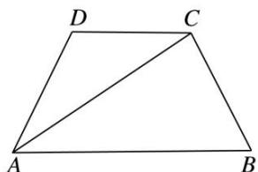
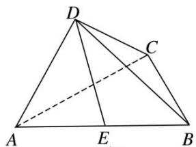

<!-- question-source:start -->
[例 5]如图 1，四边形 ABCD 为等腰梯形，AB=2，AD=DC=CB=1，将 $\triangle ADC$ 沿 AC 折起，使得平面 $ADC \perp$ 平面 ABC，E 为 AB 的中点，连接 DE，DB(如图 2).

(1)求证： $BC \perp AD;$

(2)求点 E 到平面 BCD 的距离.

  
图1

  
图2
<!-- question-source:end -->

![[高中/总复习/专题/立体几何/专题11 立体几何中的点面距离问题-立体几何（文科）/专题11_立体几何中的点面距离问题/例题/answers/Q00043772A1.md]]
