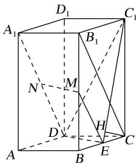

> [!faq]- 《专题11 立体几何中的点面距离问题-立体几何（文科）》例题解析
>
> > [!success]- **【答案】** C
>
> > [!note]- **【解析】**
> > 解析
> > (1)连接 $B_{1}C$ ，ME．因为 $M$ ， $E$ 分别为 $BB_{1}$ ， $BC$ 的中点，所以 $ME \parallel B_{1}C$ ，且 $ME = \frac{1}{2} B_{1}C$
> >
> > 
> >
> > 又因为 N 为 $A_{1}D$ 的中点，所以 $ND=\frac{1}{2}A_{1}D$ 。由题设知 $A_{1}B_{1}$ 纵 DC，可得 $B_{1}C\parallel A_{1}D$ ，故 $ME\parallel ND$ ，因此四边形 MNDE 为平行四边形，所以 $MN\parallel ED$ 。
> >
> > 又 $MN \notin$ 平面 $C_{1}DE$ ， $ED \subset$ 平面 $C_{1}DE$ ，所以 $MN \parallel$ 平面 $C_{1}DE$ .
> >
> > (2)过点 C 作 $C_{1}E$ 的垂线，垂足为 H．由已知可得 $DE \perp BC$ ， $DE \perp C_{1}C$ ，
> >
> > 又 $BC \cap C_{1}C = C$ ，BC， $C_{1}C \subset$ 平面 $C_{1}CE$ ，所以 $DE \perp$ 平面 $C_{1}CE$ ，
> >
> > 故 $DE \perp CH$ 。又 $C_1E \cap DE = E$ ，所以 $CH \perp$ 平面 $C_1DE$ ，故 $CH$ 的长即为点 $C$ 到平面 $C_1DE$ 的距离。
> >
> > 由已知可得 $CE = 1$ ， $C_1C = 4$ ，所以 $C_1E = \sqrt{17}$ ，故 $CH = \frac{4\sqrt{17}}{17}$ 从而点 $C$ 到平面 $C_1DE$ 的距离为 $\frac{4\sqrt{17}}{17}$
