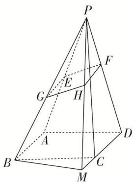
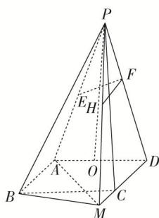

> [!faq]- 《专题11 立体几何中的点面距离问题-立体几何（文科）》例题解析
>
> > [!success]- **【答案】** 详见解析
>
> > [!note]- **【分析】**
> > 本题未单列分析。
>
> > [!note]- **【解析】**
> > 解析
> > (1)证明：取 $PB$ 的中点 $G$ ，连接 $EG$ ， $HG$ ，
> >
> > 
> >
> > 则 $EG \parallel AB$ ，且 $EG = 1$ ， $\because FH \parallel DM$ ，且 $FH = 1$ ，又 $AB \parallel DM$ ， $\therefore EG \parallel FH$ ， $EG = FH$ ，即四边形 $EFHG$ 为平行四边形， $\therefore EF \parallel GH$ 。
> >
> > 又 $EF \nsubseteq$ 平面 $PBM$ ， $GH \subset$ 平面 $PBM$ ， $\therefore EF \parallel$ 平面 $PBM$ 。
> >
> > (2) $\because EF \perp$ 平面 $PCD$ ， $CD \subset$ 平面 $PCD$ ， $\therefore EF \perp CD$ 。 $\because AD \perp CD$ ， $EF$ 和 $AD$ 显然相交， $EF$ ， $AD \subset$ 平面 $PAD$ ， $\therefore CD \perp$ 平面 $PAD$ ， $CD \subset$ 平面 $ABCD$ ， $\therefore$ 平面 $ABCD \perp$ 平面 $PAD$ 。取 $AD$ 的中点 $O$ ，连接 $PO$ ，
> >
> > 
> >
> > ∵ PA = PD, ∴ PO ⊥ AD. 又平面 ABCD ∩ 平面 PAD = AD, PO ⊂ 平面 PAD, ∴ PO ⊥ 平面 ABCD,
> > ∵ AB // CD, ∴ AB ⊥ 平面 PAD, ∵ PA ⊂ 平面 PAD, ∴ PA ⊥ AB,
> >
> > 在等腰三角形 PAD 中， $PO=\sqrt{PA^{2}-AO^{2}}=\sqrt{17-1}=4$ .
> >
> > 设点 M 到平面 ABP 的距离为 h，连接 AM，利用等体积可得 $V_{M-ABP}=V_{P-ABM}$
> >
> > 即 $\frac{1}{3} \times \frac{1}{2} \times 2 \times \sqrt{17} \times h = \frac{1}{3} \times \frac{1}{2} \times 2 \times 2 \times 4, \therefore h = \frac{8}{\sqrt{17}} = \frac{8\sqrt{17}}{17}, \therefore$ 点 $M$ 到平面 $PAB$ 的距离为 $\frac{8\sqrt{17}}{17}$ .
