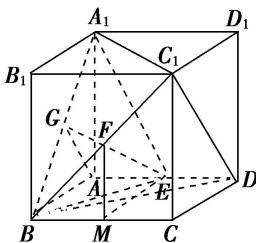

> [!faq]- 《专题11 立体几何中的点面距离问题-立体几何（文科）》例题解析
>
> > [!success]- **【答案】** 详见解析
>
> > [!note]- **【解析】**
> > 解析
> > (1)证明：取 BC 的中点 M，连接 EM，FM，
> >
> > ∵E，F分别是AD， $BC_{1}$ 的中点，∴EM//DC， $FM//C_{1}C$
> >
> > $EM \subset$ 平面 $EFM$ , $FM \subset$ 平面 $EFM$ , $EM \cap FM = M$ ,
> >
> > $DC \subset$ 平面 $C_{1} CDD_{1}$ , $C_{1} C \subset$ 平面 $C_{1} CDD_{1}$ , $DC \cap C_{1} C = C$ ,
> >
> > ∴平面 $EFM \parallel$ 平面 $C_{1}CDD_{1}$ ，而 $EF \subset$ 平面 EFM，∴ $EF \parallel$ 平面 $C_{1}CDD_{1}$ .
> >
> > 
> >
> > (2)取 $A_{1}B$ 的中点 G，连接 EG， $EA_{1}$ ，EB，易知 $EA_{1}=EB$ ，而 G 为中点，∴ $EG \perp A_{1}B$ 。连接 FG，则 $FG \parallel A_{1}C_{1}$ ，∵ 正方体棱长为 1，在 $\triangle A_{1}BC_{1}$ 中， $FG=\frac{1}{2}A_{1}C_{1}=\frac{\sqrt{2}}{2}$ .
> >
> > 在 Rt△FME 中， $EF=\frac{\sqrt{5}}{2}$ ，在 Rt△EAG 中， $EG=\frac{\sqrt{3}}{2}$
> >
> > $\therefore FG^{2} + EG^{2} = FE^{2}$ ，即 $EG\bot FG$ ，故 $EG\bot A_1C_1$ ，又 $A_{1}B$ ， $A_{1}C_{1}\subset$ 平面 $A_{1}BC_{1}$ ， $A_{1}B\cap A_{1}C_{1} = A_{1},$
> >
> > $\therefore EG \perp$ 平面 $A_{1}BC_{1}$ . 点 $G$ 到平面 $C_{1}DF$ 的距离就是点 $G$ 到平面 $C_{1}DB$ 的距离.
> >
> > ∵ $GA \parallel C_{1}D$ ，∴ $GA \parallel$ 平面 $C_{1}DB$ ，∴ 点 G 到平面 $C_{1}DB$ 的距离就是点 A 到平面 $C_{1}DB$ 的距离.
> >
> > 易知 $S \triangle BDC_{1} = \frac{\sqrt{3}}{2}$ ， $S_{\triangle ABD} = \frac{1}{2}$ ，点 $C_{1}$ 到平面 ABD 的距离为 1，
> >
> > 设点 G 到平面 $C_{1}DF$ 的距离为 d，由 $V_{C1-ABD}=V_{A-BDC1}$ 得 $\frac{1}{3}\times1\times S_{\triangle ABD}=\frac{1}{3}\cdot d\cdot S_{\triangle BDC1}$
> >
> > 即 $\frac{1}{2} = d\cdot \frac{\sqrt{3}}{2},\therefore d = \frac{\sqrt{3}}{3}$ 即点 $G$ 到平面 $C_1DF$ 的距离为 $\frac{\sqrt{3}}{3}$
