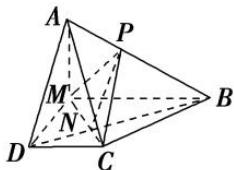

> [!faq]- 《专题11 立体几何中的点面距离问题-立体几何（文科）》例题解析
>
> > [!success]- **【答案】** B
>
> > [!note]- **【解析】**
> > 解析
> > (1) 当 $AP = \frac{1}{3} AB$ 时，有 $AD \parallel$ 平面 MPC。理由如下：
> >
> > 连接 BD 交 MC 于点 N，连接 NP．在梯形 MBCD 中，DC // MB， $\frac{DN}{NB} = \frac{DC}{MB} = \frac{1}{2}$
> >
> > 在 $\triangle ADB$ 中， $\frac{AP}{PB}=\frac{1}{2}$ ， $\therefore AD \parallel PN$ 。 $\because AD\notin$ 平面 $MPC$ ， $PN\subset$ 平面 $MPC$ ， $\therefore AD \parallel$ 平面 $MPC$ 。
> >
> > 
> >
> > (2)∵平面 $AMD \perp$ 平面 MBCD，平面 $AMD \cap$ 平面 MBCD = DM， $AM \perp DM$ ，∴ $AM \perp$ 平面 MBCD.
> >
> > $\therefore V_{P-MBC} = \frac{1}{3}\times S_{\triangle MBC}\times \frac{AM}{2} = \frac{1}{3}\times \frac{1}{2}\times 2\times 1\times \frac{1}{2} = \frac{1}{6}.$ 在 $\triangle MPC$ 中， $MP = \frac{1}{2} AB = \frac{\sqrt{5}}{2},MC = \sqrt{2},$
> >
> > $$
> > \text {又} P C = \sqrt {\left(\frac {1}{2}\right) ^ {2} + 1 ^ {2}} = \frac {\sqrt {5}}{2}, \therefore S _ {\triangle M P C} = \frac {1}{2} \times \sqrt {2} \times \sqrt {\left(\frac {\sqrt {5}}{2}\right) ^ {2} - \left(\frac {\sqrt {2}}{2}\right) ^ {2}} = \frac {\sqrt {6}}{4}.
> > $$
> >
> > ∴点 B 到平面 MPC 的距离为 $d=\frac{3V_{P-MBC}}{S_{\triangle MPC}}=\frac{3\times\frac{1}{6}}{\frac{\sqrt{6}}{4}}=\frac{\sqrt{6}}{3}$ .
> >
> > ## 【对点训练】
