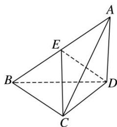

<!-- question-source:start -->
3. 如图，在三棱锥 $A - BCD$ 中， $\triangle ABC$ 是等腰直角三角形，且 $AC \perp BC, BC = 2, AD \perp$ 平面 $BCD, AD = 1$ .

(1)求证：平面 $ABC \perp$ 平面 ACD;

(2)若 E 为 AB 的中点，求点 A 到平面 CED 的距离.

<!-- question-source:end -->

![[高中/总复习/专题/立体几何/专题11 立体几何中的点面距离问题-立体几何（文科）/专题11_立体几何中的点面距离问题/对点训练/answers/Q00043776A1.md]]
