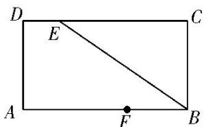
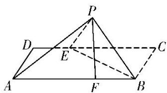

<!-- question-source:start -->
11. 如图 1, 在矩形 $ABCD$ 中, $AB = 12$ , $AD = 6$ , $E$ , $F$ 分别为 $CD$ , $AB$ 边上的点, 且 $DE = 3$ , $BF = 4$ , 将 $\triangle BCE$ 沿 $BE$ 折起来至 $\triangle PBE$ 的位置(如图 2 所示), 连接 $AP$ , $PF$ , 其中 $PF = 2\sqrt{5}$ .

(1)求证： $PF \perp$ 平面 ABED;

(2)求点 A 到平面 PBE 的距离.

  
图 1  
图 2
<!-- question-source:end -->

![[高中/总复习/专题/立体几何/专题11 立体几何中的点面距离问题-立体几何（文科）/专题11_立体几何中的点面距离问题/对点训练/answers/Q00043783A1.md]]
