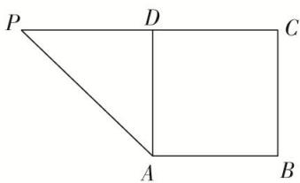
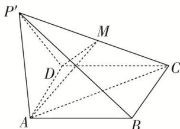
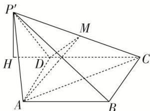

> [!faq]- 《专题11 立体几何中的点面距离问题-立体几何（文科）》例题解析
>
> > [!success]- **【答案】** 详见解析
>
> > [!note]- **【分析】**
> > 本题未单列分析。
>
> > [!note]- **【解析】**
> > $$
> > A D M \perp
> > $$
> > $$
> > P ^ {\prime} B C
> > $$
> > - **②**：若 $AB = 2$ ， $\angle P^{\prime}DC = 135^{\circ}$ ，证明：点 $C$ 到平面 $P^{\prime}AD$ 的距离等于点 $P^{\prime}$ 到平面ABCD的距离，并求出该距离.
> > 
> > 图1
> > 
> > 图 2
> > 10. 解析 ①当点 M 为 $P'C$ 的中点时，平面 $ADM \perp$ 平面 $P'BC$ ，证明如下：
> > ∵ $DP' = DC$ ，M 为 $P'C$ 的中点，∴ $P'C \perp DM$ ，
> > ∵ $AD \perp DP'$ ， $AD \perp DC$ ， $DP' \cap DC = D$ ，∴ $AD \perp$ 平面 $DP'C$ ，∴ $AD \perp P'C$ ，又 $DM \cap AD = D$ ，∴ $P'C \perp$ 平面 ADM，∴ 平面 ADM ⊥ 平面 $P'BC$ .
> > - **②**：在平面 $P'CD$ 上作 $P'H \perp CD$ 的延长线于点 H，
> > 
> > 由①中 $AD \perp$ 平面 $DP'C$ ，可知平面 $P'CD \perp$ 平面 ABCD，
> > 又平面 $P^{\prime}CD \cap$ 平面 ABCD = CD， $P^{\prime}H \subset$ 平面 $P^{\prime}CD$ ， $P^{\prime}H \perp CD$ ，∴ $P^{\prime}H \perp$ 平面 ABCD，
> > 由题意，得 $DP' = 2,\quad \angle P'DH = 45^{\circ},\quad \therefore P'H = \sqrt{2},$
> > 又 $V_{P'-ADC}=V_{C-P'AD}$ ，设点 C 到平面 $P'AD$ 的距离为 h，即 $\frac{1}{3}S_{\triangle ADC}\times P'H=\frac{1}{3}S_{\triangle P'AD}\times h$ ，由题意，知 $\triangle ADC\cong\triangle ADP'$ ，则 $S_{\triangle ADC}=S_{\triangle P'AD}$ 。∴ $P'H=h$ ，
> > 故点 C 到平面 $P^{\prime}AD$ 的距离等于点 $P^{\prime}$ 到平面 ABCD 的距离，且该距离为 $\sqrt{2}$ .
