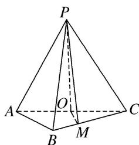
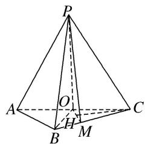

> [!faq]- 《专题11 立体几何中的点面距离问题-立体几何（文科）》例题解析
>
> > [!success]- **【答案】** 详见解析
>
> > [!note]- **【分析】**
> > 本题未单列分析。
>
> > [!note]- **【解析】**
> > (1)证明： $PO \perp$ 平面 $ABC$ ;
> > (2)若点 M 在棱 BC 上，且 MC=2MB，求点 C 到平面 POM 的距离.
> > 
> > 1. 解析
> > (1)证明：因为 $PA = PC = AC = 4$ ， $O$ 为 $AC$ 的中点，所以 $PO \perp AC$ ，且 $PO = 2\sqrt{3}$ 。连接 $OB$ 因为 $AB = BC = \frac{\sqrt{2}}{2} AC$ ，所以 $\triangle ABC$ 为等腰直角三角形，且 $OB \perp AC$ ， $OB = \frac{1}{2} AC = 2$
> > 所以 $PO^{2}+OB^{2}=PB^{2}$ ，所以 $PO\perp OB$ 。又因为 $AC\cap OB=O$ ，所以 $PO\perp$ 平面 ABC。
> > 
> > (2)作 $CH \perp OM$ , 垂足为 $H$ , 又由
> > (1)可得 $OP \perp CH$ , 所以 $CH \perp$ 平面 $POM$ .
> > 故 CH 的长为点 C 到平面 POM 的距离.
> > 由题设可知 $OC=\frac{1}{2}AC=2,\quad CM=\frac{2}{3}BC=\frac{4\sqrt{2}}{3},\quad \angle ACB=45^{\circ},$
> > 所以 $OM = \frac{2\sqrt{5}}{3}$ , $CH = \frac{OC \cdot MC \cdot \sin \angle ACB}{OM} = \frac{4\sqrt{5}}{5}$ . 所以点 $C$ 到平面 $POM$ 的距离为 $\frac{4\sqrt{5}}{5}$ .
