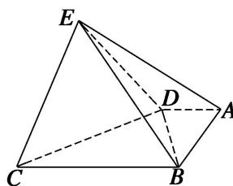
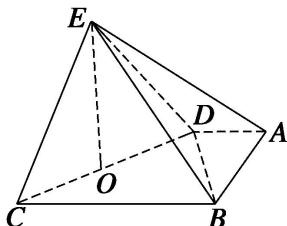

> [!faq]- 《专题11 立体几何中的点面距离问题-立体几何（文科）》例题解析
>
> > [!success]- **【答案】** 详见解析
>
> > [!note]- **【分析】**
> > 本题未单列分析。
>
> > [!note]- **【解析】**
> > (1)求证：平面 $DEC \perp$ 平面 $BDE$ ;
> > (2)求点 A 到平面 BDE 的距离.
> > 
> > 5. 解析
> > (1) 因为四边形 $ABCD$ 为直角梯形, $AD \parallel BC$ , $AB \perp BC$ , $AD = 2$ , $AB = 3$ , 所以 $BD = \sqrt{13}$ , 又因为 $BC = 7$ , $CD = 6$ , 所以根据勾股定理可得 $BD \perp CD$ , 因为 $BE = 7$ , $DE = 6$ , 同理可得 $BD \perp DE$ . 因为 $DE \cap CD = D$ , $DE \subset$ 平面 $DEC$ , $CD \subset$ 平面 $DEC$ , 所以 $BD \perp$ 平面 $DEC$ . 因为 $BD \subset$ 平面 $BDE$ , 所以平面 $DEC \perp$ 平面 $BDE$ .
> > 
> > (2)如图，取 CD 的中点 O，连接 OE，因为 $\triangle DCE$ 是边长为 6 的正三角形，
> > 所以 $EO \perp CD,\quad EO = 3\sqrt{3}$ ，由
> > (1)易知 $EO \perp$ 平面 ABCD，则 $V_{E-ABD} = \frac{1}{3} \times \frac{1}{2} \times 2 \times 3 \times 3\sqrt{3} = 3\sqrt{3}$ ，
> > 又因为 Rt△BDE 的面积为 $\frac{1}{2} \times 6 \times \sqrt{13} = 3\sqrt{13}$ ,
> > 设点 A 到平面 BDE 的距离为 h，则由 $V_{E-ABD}=V_{A-BDE}$ ，得 $\frac{1}{3}\times3\sqrt{13}h=3\sqrt{3}$ ，所以 $h=\frac{3\sqrt{39}}{13}$ ，
> > 所以点 A 到平面 BDE 的距离为 $\frac{3\sqrt{39}}{13}$ .
