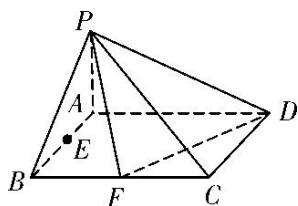
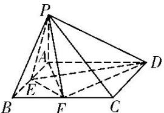

> [!faq]- 《专题11 立体几何中的点面距离问题-立体几何（文科）》例题解析
>
> > [!success]- **【答案】** 详见解析
>
> > [!note]- **【分析】**
> > 本题未单列分析。
>
> > [!note]- **【解析】**
> > (1)证明： $PF \perp FD;$
> > (2)若 PA=1，求点 E 到平面 PFD 的距离.
> > 
> > 6. 解析
> > (1)证明：连接 AF，则 $AF=\sqrt{2}$ ，又 $DF=\sqrt{2}$ ，AD=2，
> > 所以 $DF^{2}+AF^{2}=AD^{2}$ ，所以 $DF\perp AF$ .
> > 因为 $PA \perp$ 平面 ABCD，所以 $DF \perp PA$ ，又 $PA \cap AF = A$ ，所以 $DF \perp$ 平面 PAF，又 $PF \subset$ 平面 PAF，所以 $DF \perp PF$ 。
> > 
> > (2)连接 EP, ED, EF. 因为 $S_{\triangle EFD}=S_{矩形ABCD}-S_{\triangle BEF}-S_{\triangle ADE}-S_{\triangle CDF}=2-\frac{5}{4}=\frac{3}{4}$ ,
> > 所以 $V_{三棱锥P-EFD}=\frac{1}{3}S_{\triangle EFD}\cdot PA=\frac{1}{3}\times\frac{3}{4}\times1=\frac{1}{4}.$
> > 设点 E 到平面 PFD 的距离为 h，则由 $V_{三棱锥 E-PFD}=V_{三棱锥 P-EFD}$ 得
> > $\frac{1}{3}S_{\triangle PFD}\cdot h=\frac{1}{3}\times\frac{\sqrt{6}}{2}\cdot h=\frac{1}{4},$ 解得 $h=\frac{\sqrt{6}}{4}$ ，即点 E 到平面 PFD 的距离为 $\frac{\sqrt{6}}{4}$ .
