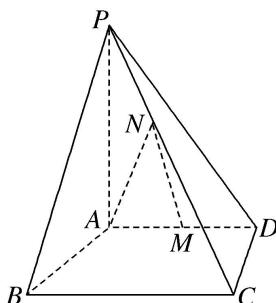
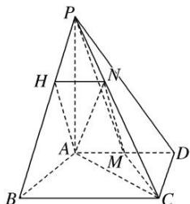

> [!faq]- 《专题11 立体几何中的点面距离问题-立体几何（文科）》例题解析
>
> > [!success]- **【答案】** 详见解析
>
> > [!note]- **【分析】**
> > 本题未单列分析。
>
> > [!note]- **【解析】**
> > (1)求证： $MN / /$ 平面PAB；
> > (2)求点 M 到平面 PAN 的距离.
> > 
> > 7. 解析
> > (1)证明：在平面 $PBC$ 内作 $NH \parallel BC$ 交 $PB$ 于点 $H$ , 连接 $AH$ ,
> > 在 $\triangle PBC$ 中， $NH \parallel BC$ ，且 $NH=\frac{1}{3}BC=1$ ， $AM=\frac{1}{2}AD=1$ ，又 $AD \parallel BC$ ， $\therefore NH \parallel AM$ 且 $NH=AM$ ， $\therefore$ 四边形 $AMNH$ 为平行四边形， $\therefore MN \parallel AH$ ，又 $AH \subset$ 平面 $PAB$ ， $MN \notin$ 平面 $PAB$ ， $\therefore MN \parallel$ 平面 $PAB$ .
> > 
> > (2)连接 AC, MC, PM, 平面 PAN 即为平面 PAC, 设点 M 到平面 PAC 的距离为 h.
> > 由题意可得 $CD = 2\sqrt{2}$ ， $AC = 2\sqrt{3}$ ， $\therefore S_{\triangle PAC} = \frac{1}{2} PA\cdot AC = 4\sqrt{3}$ ， $S_{\triangle AMC} = \frac{1}{2} AM\cdot CD = \sqrt{2},$
> > 由 $V_{M - PAC} = V_{P - AMC}$ ，得 $\frac{1}{3} S_{\triangle PAC}\cdot h = \frac{1}{3} S_{\triangle AMC}\cdot PA$ ，即 $4\sqrt{3} h = \sqrt{2}\times 4,\therefore h = \frac{\sqrt{6}}{3},$
> > ∴点 M 到平面 PAN 的距离为 $\frac{\sqrt{6}}{3}$ .
