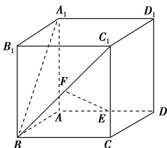

<!-- question-source:start -->
[例 4]如图，在单位正方体 $ABCD-A_{1}B_{1}C_{1}D_{1}$ 中，E，F 分别是 AD， $BC_{1}$ 的中点.

<!-- question-source:end -->

![[高中/总复习/专题/立体几何/专题11 立体几何中的点面距离问题-立体几何（文科）/专题11_立体几何中的点面距离问题_立体几何_文科_/例题/answers/Q00039858A1.md]]
