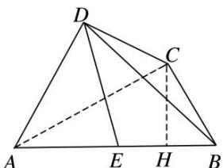

> [!faq]- 《专题11 立体几何中的点面距离问题-立体几何（文科）》例题解析
>
> > [!success]- **【答案】** 详见解析
>
> > [!note]- **【分析】**
> > 本题未单列分析。
>
> > [!note]- **【解析】**
> > (1)求证： $BC \perp AD;$
> > (2)求点 E 到平面 BCD 的距离.
> > 
> > 图1
> > 
> > 图2
> > 解析 (1)作 $CH \perp AB$ 于点 H，则 $BH = \frac{1}{2}$ ， $AH = \frac{3}{2}$ ，又 BC = 1，∴ $CH = \frac{\sqrt{3}}{2}$ ，∴ $CA = \sqrt{3}$ ，
> > ∴ $AC \perp BC$ ，∵ 平面 $ADC \perp$ 平面 ABC，且平面 $ADC \cap$ 平面 ABC = AC， $BC \subset$ 平面 ABC，
> > ∴BC⊥平面ADC，又AD⊂平面ADC，∴BC⊥AD.
> > 
> > 
> > (2)∵E为AB的中点，∴点E到平面BCD的距离等于点A到平面BCD距离的一半.
> > 而平面 $ADC \perp$ 平面 BCD, ∴ 过 A 作 $AQ \perp CD$ 于 Q, 又 ∵ 平面 $ADC \cap$ 平面 BCD = CD, 且 $AQ \subset$ 平面 ADC, ∴ $AQ \perp$ 平面 BCD, AQ 就是点 A 到平面 BCD 的距离.
> > 由(1)知 $AC=\sqrt{3}$ ，AD=DC=1，∴ $\cos\angle ADC=\frac{1^{2}+1^{2}-(\sqrt{3})^{2}}{2\times1\times1}=-\frac{1}{2}$
> > 又 $0 < \angle ADC < \pi, \therefore \angle ADC = \frac{2\pi}{3}, \therefore$ 在 Rt△QAD 中， $\angle QDA = \frac{\pi}{3}, AD = 1,$
> > $\therefore AQ = AD \cdot \sin \angle QDA = 1 \times \frac{\sqrt{3}}{2} = \frac{\sqrt{3}}{2}$ . $\therefore$ 点 $E$ 到平面 $BCD$ 的距离为 $\frac{\sqrt{3}}{4}$ .
