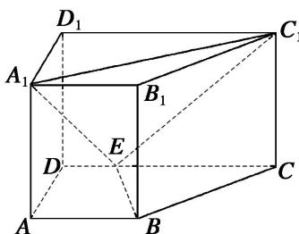
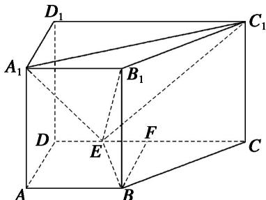

> [!faq]- 《专题11 立体几何中的点面距离问题-立体几何（文科）》例题解析
>
> > [!success]- **【答案】** 详见解析
>
> > [!note]- **【分析】**
> > 本题未单列分析。
>
> > [!note]- **【解析】**
> > (1)证明： $BE \perp$ 平面 $BB_{1}C_{1}C$ ;
> > (2)求点 $B_{1}$ 到平面 $EA_{1}C_{1}$ 的距离.
> > 
> > 2. 解析 (1) 过 $B$ 作 $CD$ 的垂线交 $CD$ 于 $F$ , 则 $BF = AD = \sqrt{2}$ , $EF = AB - DE = 1$ , $FC = 2$ .
> > 在 Rt△BFE 中， $BE=\sqrt{3}$ . 在 Rt△CFB 中， $BC=\sqrt{6}$ . 在△BEC 中，因为 $BE^{2}+BC^{2}=9=EC^{2}$ ，故 $BE\perp BC$ . 由 $BB_{1}\perp$ 平面 ABCD 得 $BE\perp BB_{1}$ ，又 $BB_{1}\cap BC=B$ ，所以 $BE\perp$ 平面 $BB_{1}C_{1}C$ .
> > 
> > (2)三棱锥 $E - A_{1}B_{1}C_{1}$ 的体积 $V = \frac{1}{3} AA_{1}\cdot S_{\triangle A_{1}B_{1}C_{1}} = \sqrt{2}$ 。在 Rt△A1D1C1 中， $A_{1}C_{1} = \sqrt{A_{1}D_{1}^{2} + D_{1}C_{1}^{2}} = 3\sqrt{2}$ .
> > 同理， $EC_{1} = \sqrt{EC^{2} + CC_{1}^{2}} = 3\sqrt{2}$ ， $A_{1}E = \sqrt{A_{1}A^{2} + AD^{2} + DE^{2}} = 2\sqrt{3}$ 故 $S_{\triangle A_1C_1E} = 3\sqrt{5}$
> > 设点 $B_{1}$ 到平面 $A_{1}C_{1}E$ 的距离为 $d$ ，则三棱锥 $B_{1} - A_{1}C_{1}E$ 的体积 $V = \frac{1}{3} \cdot d \cdot S_{\triangle A_1C_1E} = \sqrt{5} d,$
> > 从而 $\sqrt{5}d=\sqrt{2},\quad d=\frac{\sqrt{10}}{5}.$ 即点 $B_{1}$ 到平面 $EA_{1}C_{1}$ 的距离为 $\frac{\sqrt{10}}{5}.$
