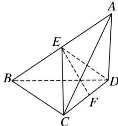

> [!faq]- 《专题11 立体几何中的点面距离问题-立体几何（文科）》例题解析
>
> > [!success]- **【答案】** 详见解析
>
> > [!note]- **【分析】**
> > 本题未单列分析。
>
> > [!note]- **【解析】**
> > (1)求证：平面 $ABC \perp$ 平面 ACD;
> > (2)若 E 为 AB 的中点，求点 A 到平面 CED 的距离.
> > 
> > 3. 解析 (1) 因为 $AD \perp$ 平面 BCD， $BC \subset$ 平面 BCD，所以 $AD \perp BC$ ，又 $AC \perp BC$ ， $AC \cap AD = A$ ，
> > AC, $AD \subset$ 平面 ABCD，所以 $BC \perp$ 平面 ACD，因为 $BC \subset$ 平面 ABC，所以平面 $ABC \perp$ 平面 ACD.
> > 
> > (2)由已知可得 $CD=\sqrt{3}$ ，取 CD 的中点 F，连接 EF，因为 E 为 AB 的中点，所以 $ED=EC=\frac{1}{2}AB=\sqrt{2}$ ，
> > 所以 $\triangle ECD$ 为等腰三角形，从而 $EF=\frac{\sqrt{5}}{2}$ ，所以 $S_{\triangle ECD}=\frac{1}{2}\times\sqrt{3}\times\frac{\sqrt{5}}{2}=\frac{\sqrt{15}}{4}$ .
> > 由(1)知 BC⊥平面 ACD，所以 E 到平面 ACD 的距离为 1， $S_{\triangle ACD}=\frac{1}{2}\times\sqrt{3}\times1=\frac{\sqrt{3}}{2}$ .
> > 设点 A 到平面 CED 的距离为 d，则 $V_{三棱锥 A-ECD}=\frac{1}{3}\cdot S_{\triangle ECD}\cdot d=V_{三棱锥 E-ACD}=\frac{1}{3}\cdot S_{\triangle ACD}\cdot1$ ，解得 $d=\frac{2\sqrt{5}}{5}$ .
