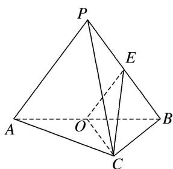
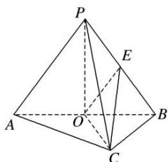

> [!faq]- 《专题11 立体几何中的点面距离问题-立体几何（文科）》例题解析
>
> > [!success]- **【答案】** 详见解析
>
> > [!note]- **【分析】**
> > 本题未单列分析。
>
> > [!note]- **【解析】**
> > (1)证明：平面 $PAB \perp$ 平面 ABC;
> > (2)求点 B 到平面 OEC 的距离.
> > 
> > 4. 解析 (1)连接 $PO$ ，在 $\triangle PAB$ 中， $PA = PB, O$ 是 $AB$ 中点， $\therefore PO \perp AB$ ，又 $\because AC = BC = 2, AC \perp BC$ ， $\therefore AB = 2\sqrt{2}, OB = OC = \sqrt{2}$ . $\because PA = PB = PC = 3, \therefore PO = \sqrt{7}, PC^2 = PO^2 + OC^2, \therefore PO \perp OC.$ 又 $AB \cap OC = O, AB \subset$ 平面 $ABC, OC \subset$ 平面 $ABC, \therefore PO \perp$ 平面 $ABC, \because PO \subset$ 平面 $PAB, \therefore$ 平面 $PAB \perp$ 平面 $ABC$ .
> > 
> > (2)∵OE 是△PAB 的中位线，∴ $OE=\frac{3}{2}$ . ∵O 是 AB 的中点，AC=BC，∴ $OC\perp AB$ .
> > 又平面 $PAB \perp$ 平面 ABC，两平面的交线为 AB，∴ OC ⊥ 平面 PAB，∵ OE ⊂ 平面 PAB，∴ OC ⊥ OE.
> > 设点 B 到平面 OEC 的距离为 d，则 $V_{B-OEC}=V_{E-OBC}$ ，∴ $\frac{1}{3}\times S_{\triangle OEC}\cdot d=\frac{1}{3}\times S_{\triangle OBC}\times\frac{1}{2}OP$ ，
> > $$
> > d = \frac {S _ {\triangle O B C} \cdot \frac {1}{2} O P}{S _ {\triangle O E C}} = \frac {\frac {1}{2} O B \cdot O C \cdot \frac {1}{2} O P}{\frac {1}{2} O E \cdot O C} = \frac {\sqrt {1 4}}{3}.
> > $$
