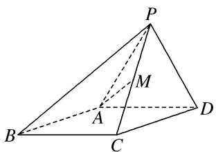
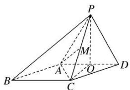

> [!faq]- 《专题11 立体几何中的点面距离问题-立体几何（文科）》例题解析
>
> > [!success]- **【答案】** 详见解析
>
> > [!note]- **【分析】**
> > 本题未单列分析。
>
> > [!note]- **【解析】**
> > (1)求证： $PC \perp AD;$
> > (2)求点 D 到平面 PAM 的距离.
> > 
> > 8. 解析 (1)证明：如图，取 $AD$ 的中点 $O$ ，连接 $OP$ ， $OC$ ， $AC$ ，由题意易知 $\triangle ACD$ 为正三角形。所以 $OC \perp AD$ ，又 $\triangle PAD$ 是正三角形， $O$ 为 $AD$ 的中点，所以 $OP \perp AD$ ，又 $OC \cap OP = O$ ，所以 $AD \perp$ 平面 $POC$ ，又 $PC \subset$ 平面 $POC$ ，所以 $PC \perp AD$ 。
> > 
> > (2)点 D 到平面 PAM 的距离即点 D 到平面 PAC 的距离，由(1)可知， $PO \perp AD$ ，又平面 $PAD \perp$ 平面 ABCD，平面 $PAD \cap$ 平面 ABCD = AD， $PO \subset$ 平面 PAD，所以 $PO \perp$ 平面 ABCD，即 PO 为三棱锥 P-ACD 的高。
> > 在 Rt△POC 中， $PO=OC=\sqrt{3}$ ， $PC=\sqrt{6}$ ，
> > 在 $\triangle PAC$ 中， $PA = AC = 2$ ， $PC = \sqrt{6}$ ，边 $PC$ 上的高 $AM = \sqrt{PA^2 - PM^2} = \sqrt{2^2 - \left(\frac{\sqrt{6}}{2}\right)^2} = \frac{\sqrt{10}}{2},$
> > 所以 $S_{\triangle PAC} = \frac{1}{2} PC\cdot AM = \frac{1}{2}\times \sqrt{6}\times \frac{\sqrt{10}}{2} = \frac{\sqrt{15}}{2}.$
> > 设点 D 到平面 PAC 的距离为 h，由 $V_{D-PAC}=V_{P-ACD}$ ，得 $\frac{1}{3}S_{\triangle PAC}\cdot h=\frac{1}{3}S_{\triangle ACD}\cdot PO$ ，
> > 又 $S_{\triangle ACD}=\frac{1}{2}\times2\times\sqrt{3}=\sqrt{3}$ ，所以 $\frac{1}{3}\times\frac{\sqrt{15}}{2}\cdot h=\frac{1}{3}\times\sqrt{3}\times\sqrt{3}$ ，解得 $h=\frac{2\sqrt{15}}{5}$ .
> > 故点 D 到平面 PAM 的距离为 $\frac{2\sqrt{15}}{5}$ .
