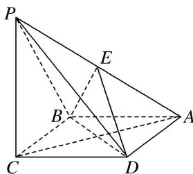
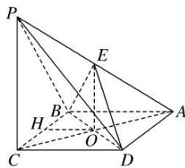

> [!faq]- 《专题11 立体几何中的点面距离问题-立体几何（文科）》例题解析
>
> > [!success]- **【答案】** 详见解析
>
> > [!note]- **【分析】**
> > 本题未单列分析。
>
> > [!note]- **【解析】**
> > (1)求证：平面 $BED \perp$ 平面 $PAC$ ;
> > (2)求点 E 到平面 PBC 的距离.
> > 
> > 9. 解析 (1)证明：在平行四边形ABCD中， $AB=BC$ ，∴四边形ABCD是菱形，∴ $BD\perp AC$ 。
> > ∵PC⊥平面ABCD，BD⊂平面ABCD，∴PC⊥BD，又PC∩AC=C，∴BD⊥平面PAC，
> > ∵BD⊂平面BED，∴平面BED⊥平面PAC.
> > 
> > (2)设 $AC$ 交 $BD$ 于点 $O$ , 连接 $OE$ , 如图. 在 $\triangle PCA$ 中, 易知 $O$ 为 $AC$ 的中点, 又 $E$ 为 $PA$ 的中点, $\therefore EO//PC$ , $\because PC \subset$ 平面 $PBC$ , $EO \notin$ 平面 $PBC$ , $\therefore EO//$ 平面 $PBC$ . $\therefore$ 点 $O$ 到平面 $PBC$ 的距离就是点 $E$ 到平面 $PBC$ 的距离. $\because PC \perp$ 平面 $ABCD$ , $PC \subset$ 平面 $PBC$ , $\therefore$ 平面 $PBC \perp$ 平面 $ABCD$ , 且两平面的交线为 $BC$ . 在平面 $ABCD$ 内过点 $O$ 作 $OH \perp BC$ 于点 $H$ , 则 $OH \perp$ 平面 $PBC$ , 在 Rt $\triangle BOC$ 中, $BC = 2a$ , $OC = \frac{1}{2} AC = \sqrt{3} a$ , $\therefore OB = a$ . 由 $S_{\triangle BOC} = \frac{1}{2} OC \cdot OB = \frac{1}{2} BC \cdot OH$ , 得 $OH = \frac{OB \cdot OC}{BC} = \frac{a \cdot \sqrt{3} a}{2a} = \frac{\sqrt{3}}{2} a$ , $\therefore$ 点 $E$ 到平面 $PBC$ 的距离为 $\frac{\sqrt{3}}{2} a$ .
