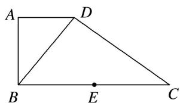
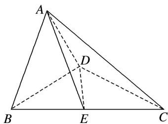

> [!faq]- 《专题11 立体几何中的点面距离问题-立体几何（文科）》例题解析
>
> > [!success]- **【答案】** 详见解析
>
> > [!note]- **【分析】**
> > 本题未单列分析。
>
> > [!note]- **【解析】**
> > (1)求证： $AB \perp$ 平面 ADC;
> > (2)若 $AD = 1$ ， $AB = \sqrt{2}$ ，求点 $B$ 到平面 $ADE$ 的距离.
> > 
> > 
> > 12. 解析 (1) 因为平面 $ABD \perp$ 平面 $BCD$ ，平面 $ABD \cap$ 平面 $BCD = BD$ ，又 $BD \perp DC$ ， $DC \subset$ 平面 $BCD$ ，所以 $DC \perp$ 平面 $ABD$ ，因为 $AB \subset$ 平面 $ABD$ ，所以 $DC \perp AB$ 。又 $AD \perp AB$ ， $DC \cap AD = D$ ， $AD$ ， $DC \subset$ 平面 $ADC$ ，所以 $AB \perp$ 平面 $ADC$ .
> > (2)因为 $AB = \sqrt{2}$ , $AD = 1$ , 所以 $BD = \sqrt{3}$ . 依题意 $\triangle ABD \sim \triangle DCB$ , 所以 $\frac{AB}{AD} = \frac{CD}{BD}$ , 即 $\frac{\sqrt{2}}{1} = \frac{CD}{\sqrt{3}}$ . 所以 $CD = \sqrt{6}$ , 故 $BC = 3$ , 由于 $AB \perp$ 平面 $ADC$ , $AB \perp AC$ , $E$ 为 $BC$ 的中点, 所以 $AE = \frac{BC}{2} = \frac{3}{2}$ . 同理 $DE = \frac{BC}{2} = \frac{3}{2}$ , 所以 $S_{\triangle ADE} = \frac{1}{2} \times 1 \times \sqrt{\left(\frac{3}{2}\right)^2 - \left(\frac{1}{2}\right)^2} = \frac{\sqrt{2}}{2}$ , 因为 $DC \perp$ 平面 $ABD$ , 所以 $V_{A-BCD} = \frac{1}{3} CD \cdot S_{\triangle ABD} = \frac{\sqrt{3}}{3}$ , 设点 $B$ 到平面 $ADE$ 的距离为 $d$ , 则 $\frac{1}{3} d \cdot S_{\triangle ADE} = V_{B-ADE} = V_{A-BDE} = \frac{1}{2} V_{A-BCD} = \frac{\sqrt{3}}{6}$ , 所以 $d = \frac{\sqrt{6}}{2}$ , 即点 $B$ 到平面 $ADE$ 的距离为 $\frac{\sqrt{6}}{2}$ .
