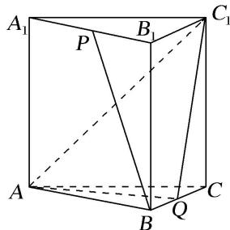

<!-- question-source:start -->
[例1] (2018·江苏)如图，在正三棱柱 $ABC - A_{1}B_{1}C_{1}$ 中， $AB = AA_{1} = 2$ ，点 $P, Q$ 分别为 $A_{1}B_{1}, BC$ 的中点.

(1)求异面直线 BP 与 $AC_{1}$ 所成角的余弦值;

(2)求直线 $CC_{1}$ 与平面 $AQC_{1}$ 所成角的正弦值.

<!-- question-source:end -->

![[高中/总复习/专题/立体几何/专题12 利用空间向量计算空间角的综合问题-立体几何（理科）/考点01_求两个空间角/例题/answers/Q00039873A1.md]]
