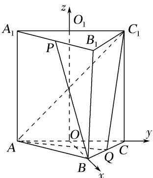

> [!faq]- 《专题12 利用空间向量计算空间角的综合问题-立体几何（理科）》例题解析
>
> > [!success]- **【答案】** 详见解析
>
> > [!note]- **【分析】**
> > 本题未单列分析。
>
> > [!note]- **【解析】**
> > 解析 如图，在正三棱柱 $ABC - A_{1}B_{1}C_{1}$ 中，设 $AC$ ， $A_{1}C_{1}$ 的中点分别为 $O$ ， $O_{1}$ ，连接 $OB$ ， $OO_{1}$ ，则 $OB\bot OC$ ， $OO_{1}\bot OC$ ， $OO_{1}\bot OB$ ，以 $\{\overrightarrow{OB},\overrightarrow{OC},\overrightarrow{OD}_{1}\}$ 为基底，建立如图所示的空间直角坐标系 $O - xyz.$
> >
> > 因为 $AB = AA_{1} = 2$ ，所以 $A(0, -1, 0)$ ， $B(\sqrt{3}, 0, 0)$ ， $C(0, 1, 0)$ ， $A_{1}(0, -1, 2)$ ， $B_{1}(\sqrt{3}, 0, 2)$ ， $C_{1}(0, 1, 2)$ .
> >
> > 
> >
> > (1)因为 $P$ 为 $A_{1}B_{1}$ 的中点，所以 $P\left[\frac{\sqrt{3}}{2}, - \frac{1}{2}, 2\right]$ ，从而 $\overrightarrow{BP} = \left[-\frac{\sqrt{3}}{2}, - \frac{1}{2}, 2\right], \overrightarrow{AC_1} = (0, 2, 2)$ ，
> >
> > 故 $|\cos < \overrightarrow{BP}, \overrightarrow{AC_1} >| = \frac{|\overrightarrow{BP} \cdot \overrightarrow{AC_1}|}{|\overrightarrow{BP}| \cdot |\overrightarrow{AC_1}|} = \frac{| - 1 + 4|}{\sqrt{5} \times 2\sqrt{2}} = \frac{3\sqrt{10}}{20}$ .
> >
> > 因此，异面直线 BP 与 $AC_{1}$ 所成角的余弦值为 $\frac{3\sqrt{10}}{20}$ .
> >
> > (2)因为 Q 为 BC 的中点，所以 $Q\left(\frac{\sqrt{3}}{2}, \frac{1}{2}, 0\right)$ ,
> >
> > 因此 $\overrightarrow{AQ}=\left(\frac{\sqrt{3}}{2},\frac{3}{2},0\right)$ ， $\overrightarrow{AC}_{1}=(0,2,2)$ ， $\overrightarrow{CAC}_{1}=(0,0,2)$ .
> >
> > 设 $\boldsymbol{n}=(x,y,z)$ 为平面 $AQC_{1}$ 的一个法向量，则 $\left\{\begin{aligned}\overrightarrow{AQ}\cdot\boldsymbol{n}&=0,\\ \overrightarrow{AC_{1}}\cdot\boldsymbol{n}&=0,\end{aligned}\right.$ 即 $\left\{\begin{aligned}\frac{\sqrt{3}}{2}x+\frac{3}{2}y&=0,\\ 2y+2z&=0.\end{aligned}\right.$
> >
> > 不妨取 $n=(\sqrt{3}, -1, 1)$ .
> >
> > 设直线 $CC_{1}$ 与平面 $AQC_{1}$ 所成角为 $\theta$ ,
> >
> > 则 $\sin\theta=|\cos<\overrightarrow{C}C_{1},\quad n>|=\frac{|\overrightarrow{C}C_{1}\cdot n|}{|\overrightarrow{C}C_{1}|\cdot|n|}=\frac{2}{\sqrt{5}\times2}=\frac{\sqrt{5}}{5},$
> >
> > 所以直线 $CC_{1}$ 与平面 $AQC_{1}$ 所成角的正弦值为 $\frac{\sqrt{5}}{5}$ .
