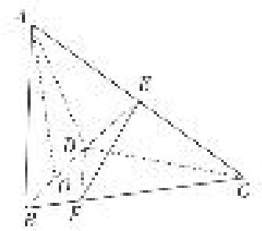
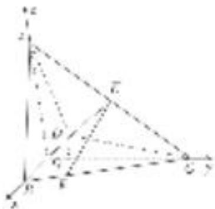

> [!faq]- 《专题12 利用空间向量计算空间角的综合问题-立体几何（理科）》例题解析
>
> > [!success]- **【答案】** 详见解析
>
> > [!note]- **【分析】**
> > 本题未单列分析。
>
> > [!note]- **【解析】**
> > (1)求直线 AB 与 DE 所成角的余弦值;
> > (2)若点 F 在 BC 上，满足 $BF=\frac{1}{4}BC$ ，设二面角 F-DE-C 的大小为 $\theta$ ，求 $\sin\theta$ 的值.
> > 
> > 解析 (1)连接 $CO$ ， $\because CB = CD$ ， $BO = OD$ ， $\therefore CO \perp BD$ .
> > 又 $AO \perp$ 平面 BCD，∴ AO，BO，CO 两两垂直.
> > 以 O 为坐标原点，OB，OC，OA 所在直线分别为 x，y，z 轴建立空间直角坐标系，则 $A(0, 0, 2)$ ， $B(1, 0, 0)$ ， $C(0, 2, 0)$ ， $D(-1, 0, 0)$ ， $\therefore E(0, 1, 1)$ .
> > 
> > $\therefore \overrightarrow{AB} = (1, 0, -2), \overrightarrow{DE} = (1, 1, 1), \therefore \cos < \overrightarrow{AB}, \overrightarrow{DE} > = \frac{-1}{\sqrt{5} \times \sqrt{3}} = -\frac{\sqrt{15}}{15}.$
> > ∴直线 AB 与 DE 所成角的余弦值为 $\frac{\sqrt{15}}{15}$ .
> > (2)设平面 $DEC$ 的法向量为 $\pmb{n}_{1} = (x, y, z)$ , $\because \vec{DC} = (1, 2, 0)$ , $\left\{ \begin{array}{l} \pmb{n}_{1} \cdot \vec{DC} = 0, \\ \pmb{n}_{1} \cdot \vec{DE} = 0, \end{array} \right.$ $\therefore \left\{ \begin{array}{l} x + 2y = 0, \\ x + y + z = 0, \end{array} \right.$
> > 令 y=1，则 x=-2，z=1， $n_{1}=(-2,1,1)$ 。设平面 DEF 的法向量为 $n_{2}=(x_{1},y_{1},z_{1})$ ，
> > $$
> > \because \overrightarrow {D F} = \overrightarrow {D B} + \overrightarrow {B F} = \overrightarrow {D B} + \frac {1}{4} \overrightarrow {B C} = \left( \begin{array}{c c c} 7 & \\ 4 & \frac {1}{2}, & 0 \end{array} \right), \quad \left\{ \begin{array}{l} n _ {2} \cdot \overrightarrow {D F} = 0, \\ n _ {2} \cdot \overrightarrow {D E} = 0, \end{array} \right. \quad \therefore \left\{ \begin{array}{l} \frac {7}{4} x _ {1} + \frac {1}{2} y _ {1} = 0, \\ x _ {1} + y _ {1} + z _ {1} = 0. \end{array} \right.
> > $$
> > 令 $y_{1}=-7$ ，则 $x_{1}=2,\quad z_{1}=5,\quad n_{2}=(2,-7,5)$ .
> > $$
> > \therefore \cos <   n _ {1}, n _ {2} > = \frac {- 6}{\sqrt {6} \times \sqrt {7 8}} = - \frac {1}{\sqrt {1 3}}. \quad \therefore \sin \theta = \frac {\sqrt {1 2}}{\sqrt {1 3}} = \frac {2 \sqrt {3 9}}{1 3}.
> > $$
