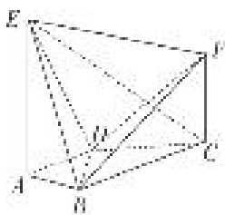
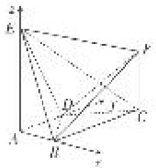
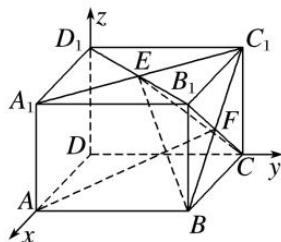
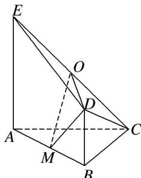
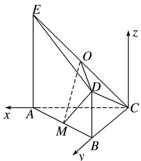

> [!faq]- 《专题12 利用空间向量计算空间角的综合问题-立体几何（理科）》例题解析
>
> > [!success]- **【答案】** 详见解析
>
> > [!note]- **【分析】**
> > 本题未单列分析。
>
> > [!note]- **【解析】**
> > (1)求证： $BF \parallel$ 平面 ADE;
> > (2)求直线 CE 与平面 BDE 所成角的正弦值;
> > (3)若二面角 $E - BD - F$ 的余弦值为 $\frac{1}{3}$ ，求线段 $CF$ 的长.
> > 
> > 解析 (1)以 $A$ 为坐标原点， $AB$ 所在的直线为 $x$ 轴， $AD$ 所在的直线为 $y$ 轴， $AE$ 所在的直线为 $z$ 轴，建立如图所示的空间直角坐标系．则 $A(0,0,0), B(1,0,0)$ ，设 $F(1,2,h)$ .
> > 依题意， $\overrightarrow{AB}=(1,0,0)$ 是平面ADE的一个法向量，又 $\overrightarrow{BF}=(0,2,h)$ ，可得 $\overrightarrow{BF}\cdot\overrightarrow{AB}=0$ ，
> > 又因为直线 $BF \nmid$ 平面 $ADE$ , 所以 $BF \parallel$ 平面 $ADE$ .
> > 
> > (2)依题意， $D(0,1,0),E(0,0,2),C(1,2,0)$ ，则 $\overrightarrow{BD} = (-1,1,0),\overrightarrow{BE} = (-1,0,2),\overrightarrow{CE} = (-$ $1, - 2,2)$
> > 设 $\boldsymbol{n}=(x,y,z)$ 为平面 BDE 的法向量，则 $\left\{\begin{aligned}\boldsymbol{n}\cdot\overrightarrow{BD}&=0,\\ \boldsymbol{n}\cdot\overrightarrow{BE}&=0,\end{aligned}\right.$ 即 $\left\{\begin{aligned}-x+y&=0,\\ -x+2z&=0,\end{aligned}\right.$ 不妨令 z=1，可得 $\boldsymbol{n}=(2,$
> > 因此有 $\cos<\overrightarrow{CE},\quad n>=\frac{\overrightarrow{CE}\cdot\boldsymbol{n}}{|\overrightarrow{CE}||\boldsymbol{n}|}=-\frac{4}{9}$ . 所以直线 CE 与平面 BDE 所成角的正弦值为 $\frac{4}{9}$ .
> > (3)设 $m=(x_{1},y_{1},z_{1})$ 为平面 BDF 的法向量，则 $\left\{\begin{aligned}m\cdot\overrightarrow{BD}&=0,\\ m\cdot\overrightarrow{BF}&=0,\end{aligned}\right.$ 即 $\left\{\begin{aligned}-x_{1}+y_{1}&=0,\\ 2y_{1}+hz_{1}&=0,\end{aligned}\right.$ 不妨令 $y_{1}=1$ ，可得 $m=\left(1,1,-\frac{2}{h}\right)$ 。由题意，有 $|\cos<m,n>|=\frac{|m\cdot n|}{|m||n|}=\frac{\left|4-\frac{2}{h}\right|}{3\sqrt{2+\frac{4}{h^{2}}}}=\frac{1}{3}$ ，解得 $h=\frac{8}{7}$ 。经检验，符合题意。所以线段 CF 的长为 $\frac{8}{7}$ 。
> > ## 【对点训练】
> > 1. 如图，在长方体 $AC_{1}$ 中， $AB = BC = 2$ ， $AA_{1} = \sqrt{2}$ ，点 $E$ ， $F$ 分别是平面 $A_{1}B_{1}C_{1}D_{1}$ ，平面 $BCC_{1}B_{1}$ 的中心。以 $D$ 为坐标原点， $DA$ ， $DC$ ， $DD_{1}$ 所在直线分别为 $x$ 轴， $y$ 轴， $z$ 轴建立空间直角坐标系。试用向量方法解决下列问题：
> > (1)求异面直线 AF 和 BE 所成的角;
> > (2)求直线 $AF$ 和平面 $BEC$ 所成角的正弦值.
> > 
> > 1. 解析 (1)由题意得 $A(2, 0, 0)$ , $F\left(1, 2, \frac{\sqrt{2}}{2}\right)$ , $B(2, 2, 0)$ , $E(1, 1, \sqrt{2})$ , $C(0, 2, 0)$ .
> > $$
> > \therefore \overrightarrow {A F} = \left[ - 1, 2, \frac {\sqrt {2}}{2} \right], \overrightarrow {B E} = (- 1, - 1, \sqrt {2}),
> > $$
> > $$
> > \therefore \overrightarrow {A F} \cdot \overrightarrow {B E} = 1 - 2 + 1 = 0
> > $$
> > $$
> > 9 0 ^ {\circ}
> > $$
> > (2)设平面 BEC 的法向量为 $\boldsymbol{n}=(x,y,z)$ ，又 $\overrightarrow{BC}=(-2,0,0)$ ， $\overrightarrow{BE}=(-1,-1,\sqrt{2})$ ，则 $n\cdot\overrightarrow{BC}=-2x=0$ ， $n\cdot\overrightarrow{BE}=-x-y+\sqrt{2}z=0$ ，∴ x=0，取 z=1，则 $y=\sqrt{2}$ ，
> > ∴平面 BEC 的一个法向量为 $\boldsymbol{n}=(0,\sqrt{2},1)$ . $\therefore\cos<\overrightarrow{AF},\quad\boldsymbol{n}>\frac{\overrightarrow{AF}\cdot\boldsymbol{n}}{|\overrightarrow{AF}|\cdot|\boldsymbol{n}|}=\frac{\frac{5\sqrt{2}}{2}}{\frac{\sqrt{22}}{2}\times\sqrt{3}}=\frac{5\sqrt{33}}{33}.$
> > 设直线 $AF$ 和平面 $BEC$ 所成的角为 $\theta$ ，则 $\sin \theta = \frac{5\sqrt{33}}{33}$ ，即直线 $AF$ 和平面 $BEC$ 所成角的正弦值为 $\frac{5\sqrt{33}}{33}$ 。2. 如图，平面 $ABDE \perp$ 平面 $ABC$ ， $\triangle ABC$ 是等腰直角三角形， $AC = BC = 4$ ，四边形 $ABDE$ 是直角梯形， $BD // AE$ ， $BD \perp BA$ ， $BD = \frac{1}{2}AE = 2$ ， $O$ ， $M$ 分别为 $CE$ ， $AB$ 的中点。
> > (1)求异面直线 AB 与 CE 所成角的大小;
> > (2)求直线 CD 与平面 ODM 所成角的正弦值.
> > 
> > 2. 解析 (1)∵DB⊥BA，平面ABDE⊥平面ABC，平面ABDE∩平面ABC=AB，DB⊂平面ABDE，
> > ∴DB⊥平面ABC. ∵BD∥AE, ∴EA⊥平面ABC.
> > 如图所示，以 C 为坐标原点，分别以 CA, CB 所在直线为 x, y 轴，以过点 C 且与 EA 平行的直线为 z 轴，建立空间直角坐标系.
> > 
> > $\because AC = BC = 4, \therefore C(0, 0, 0), A(4, 0, 0), B(0, 4, 0), E(4, 0, 4),$
> > $\therefore \overrightarrow{AB} = (-4, 4, 0), \overrightarrow{CE} = (4, 0, 4). \therefore \cos < \overrightarrow{AB}, \overrightarrow{CE} > = \frac{-16}{4\sqrt{2} \times 4\sqrt{2}} = -\frac{1}{2},$
> > ∴异面直线 AB 与 CE 所成角的大小为 $\frac{\pi}{3}$ .
> > (2)由(1)知 $O(2,0,2)$ , $D(0,4,2)$ , $M(2,2,0)$ ,
> > $\therefore \overrightarrow{CD} = (0, 4, 2), \overrightarrow{OD} = (-2, 4, 0), \overrightarrow{MD} = (-2, 2, 2).$
> > 设平面 ODM 的法向量为 $\boldsymbol{n}=(x,y,z)$ ,
> > 则由 $\left\{\begin{aligned}n\perp\overrightarrow{OD},\\ n\perp\overrightarrow{MD},\end{aligned}\right.$ 可得 $\left\{\begin{aligned}-2x+4y=0,\\ -2x+2y+2z=0,\end{aligned}\right.$ 令 x=2，则 y=1，z=1，∴n=(2，1，1).
> > 设直线 $CD$ 与平面 $ODM$ 所成的角为 $\theta$ ，则 $\sin \theta = |\cos < n, \vec{CD} >| = \left|\frac{n \cdot \vec{CD}}{|n||\vec{CD}|}\right| = \frac{\sqrt{30}}{10}$ ,
> > ∴直线 CD 与平面 ODM 所成角的正弦值为 $\frac{\sqrt{30}}{10}$ .
