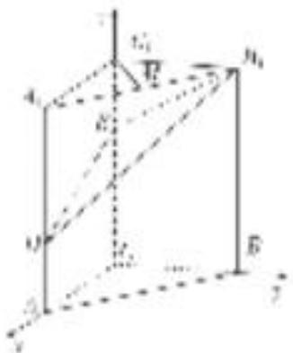

> [!faq]- 《专题12 利用空间向量计算空间角的综合问题-立体几何（理科）》例题解析
>
> > [!success]- **【答案】** 详见解析
>
> > [!note]- **【分析】**
> > 本题未单列分析。
>
> > [!note]- **【解析】**
> > 解析 解法一：依题意，以 C 为坐标原点，分别以 $\overrightarrow{CA}, \overrightarrow{CB}, \overrightarrow{CC_{1}}$ 的方向为 x 轴、y 轴、z 轴的正方向建立空间直角坐标系(如图)，
> >
> > 
> >
> > 可得 $C(0, 0, 0)$ ， $A(2, 0, 0)$ ， $B(0, 2, 0)$ ， $C_{1}(0, 0, 3)$ ， $A_{1}(2, 0, 3)$ ， $B_{1}(0, 2, 3)$ ， $D(2, 0, 1)$ ， $E(0, 0, 2)$ ， $M(1, 1, 3)$ .
> >
> > (1)依题意， $\overrightarrow{C_{1}M}=(1,1,0)$ ， $\overrightarrow{B_{1}D}=(2,-2,-2)$ ，从而 $\overrightarrow{C_{1}M}\cdot\overrightarrow{B_{1}D}=2-2+0=0$ ，所以 $C_{1}M\perp B_{1}D$ .
> >
> > (2)依题意， $\overrightarrow{CA}=(2,0,0)$ 是平面 $BB_{1}E$ 的一个法向量， $\overrightarrow{EB_{1}}=(0,2,1)$ ， $\overrightarrow{ED}=(2,0,-1)$ .
> >
> > 设 $\boldsymbol{n}=(x,y,z)$ 为平面 $DB_{1}E$ 的一个法向量，则 $\left\{\begin{aligned}\boldsymbol{n}\cdot\vec{EB}_{1}&=0,\\ \boldsymbol{n}\cdot\vec{ED}&=0,\end{aligned}\right.$ 即 $\left\{\begin{aligned}2y+z&=0,\\ 2x-z&=0,\end{aligned}\right.$ 令 x=1，可得 $\boldsymbol{n}=(1,$
> >
> > $$
> > \cos <   \overrightarrow {C A}, \quad n > = \frac {\overrightarrow {C A} \cdot n}{| \overrightarrow {C A} | | n |} = \frac {2}{2 \times \sqrt {6}} = \frac {\sqrt {6}}{6}, \sin <   \overrightarrow {C A}, \quad n > = \sqrt {1 - \cos^ {2} \langle \overrightarrow {C A} , n \rangle} = \frac {\sqrt {3 0}}{6}.
> > $$
> >
> > 所以二面角 $B-B_{1}E-D$ 的正弦值为 $\frac{\sqrt{30}}{6}$ .
> >
> > (3) $\overrightarrow{AB}=(-2,2,0)$ ，由
> > (2)知 $n=(1,-1,2)$ 为平面 $DB_{1}E$ 的一个法向量，
> >
> > 于是 $\cos <\overrightarrow{AB}$ , $n>=\frac{\overrightarrow{AB} \cdot n}{|\overrightarrow{AB}||n|}=\frac{-4}{2\sqrt{2} \times \sqrt{6}}=-\frac{\sqrt{3}}{3}$ . 所以直线 $AB$ 与平面 $DB_{1}E$ 所成角的正弦值为 $\frac{\sqrt{3}}{3}$ .
> >
> > [例 4] (2019·天津)如图， $AE \perp$ 平面 ABCD， $CF \parallel AE$ ， $AD \parallel BC$ ， $AD \perp AB$ ，AB = AD = 1，AE = BC = 2.
