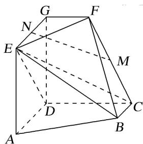

<!-- question-source:start -->
7. (2018·天津)如图, $AD \parallel BC$ 且 $AD = 2BC$ , $AD \perp CD$ , $EG \parallel AD$ 且 $EG = AD$ , $CD \parallel FG$ 且 $CD = 2FG$ , $DG \perp$ 平面 $ABCD$ , $DA = DC = DG = 2$ .

(1)若 M 为 CF 的中点，N 为 EG 的中点，求证：MN// 平面 CDE;

(2)求二面角 E-BC-F 的正弦值;

(3)若点 P 在线段 DG 上，且直线 BP 与平面 ADGE 所成的角为 $60^{\circ}$ ，求线段 DP 的长.

<!-- question-source:end -->

![[高中/总复习/专题/立体几何/专题12 利用空间向量计算空间角的综合问题-立体几何（理科）/考点01_求两个空间角/对点训练/answers/Q00039881A1.md]]
