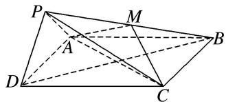

<!-- question-source:start -->
4. (2017·北京)如图, 在四棱锥 $P - ABCD$ 中, 底面 $ABCD$ 为正方形, 平面 $PAD \perp$ 平面 $ABCD$ , 点 $M$ 在线段 $PB$ 上, $PD \parallel$ 平面 $MAC$ , $PA = PD = \sqrt{6}$ , $AB = 4$ .

(1)求证： $M$ 为 $PB$ 的中点；

(2)求平面 BPD 与平面 APD 的夹角;

(3)求直线 MC 与平面 BDP 所成角的正弦值.

<!-- question-source:end -->

![[高中/总复习/专题/立体几何/专题12 利用空间向量计算空间角的综合问题-立体几何（理科）/考点01_求两个空间角/对点训练/answers/Q00043790A1.md]]
