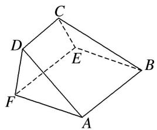
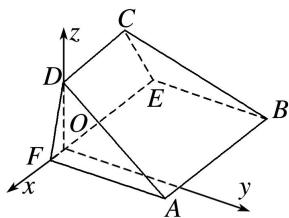

> [!faq]- 《专题12 利用空间向量计算空间角的综合问题-立体几何（理科）》例题解析
>
> > [!success]- **【答案】** 详见解析
>
> > [!note]- **【分析】**
> > 本题未单列分析。
>
> > [!note]- **【解析】**
> > (1)求异面直线 BC，DF 所成角的大小；
> > (2)求平面 BDE 与平面 BEC 所成角的余弦值.
> > 
> > 3. 解析 因为四边形 $ABEF$ 为正方形， $AF \perp DF$ ，所以 $AF \perp$ 平面 $DCEF$ .
> > 
> > 又 $\angle DFE = \angle CEF = 45^{\circ}$ ，所以，在平面 DCEF 内作 $DO \perp EF$ ，垂足为点 O，
> > 以 O 为坐标原点，OF 所在的直线为 x 轴，OD 所在的直线为 z 轴建立空间直角坐标系(如图所示). 设 OF=a，因为 $AF=2\sqrt{2}FD$ ，所以 $DF=\sqrt{2}a$ ，AF=4a，CD=2a.
> > (1) $\therefore D(0, 0, a)$ , $F(a, 0, 0)$ , $B(-3a, 4a, 0)$ , $C(-2a, 0, a)$ .
> > 则 $\overrightarrow{BC}=(a,-4a,a),\overrightarrow{DF}=(a,0,-a),$
> > 设向量 $\overrightarrow{BC}$ ， $\overrightarrow{DF}$ 的夹角为 $\theta$ ，则 $\cos \theta = \frac{\overrightarrow{BC} \cdot \overrightarrow{DF}}{|\overrightarrow{BC}| \cdot |\overrightarrow{DF}|} = 0$ ，所以异面直线 $BC$ ， $DF$ 所成角为 $\frac{\pi}{2}$ .
> > (2) $\because E(-3a, 0, 0), \vec{BC}=(a, -4a, a), \vec{BE}=(0, -4a, 0), \vec{DE}=(-3a, 0, -a),$
> > $$
> > \boldsymbol {n} _ {1} = \left(x _ {1}, y _ {1}, z _ {1}\right)
> > $$
> > 由 $\left\{\begin{aligned}\boldsymbol{n}_{1}\cdot\vec{D}E=0,\\\boldsymbol{n}_{1}\cdot\vec{B}E=0,\end{aligned}\right.$ 得 $\left\{\begin{aligned}3x_{1}+z_{1}=0,\\4y_{1}=0,\end{aligned}\right.$ 取 $x_{1}=1$ 得平面 DBE 的一个法向量为 $\boldsymbol{n}_{1}=(1,0,-3)$ ,
> > 设平面 CBE 的法向量为 $\boldsymbol{n}_{2}=(x_{2},y_{2},z_{2})$ ,
> > 由 $\left\{\begin{aligned}n_{2}\cdot\overrightarrow{BC}&=0,\\ n_{2}\cdot\overrightarrow{BE}&=0,\end{aligned}\right.$ 得 $\left\{\begin{aligned}x_{2}-4y_{2}+z_{2}&=0,\\ 4y_{2}&=0,\end{aligned}\right.$ 取 $x_{2}=1$ 得平面 CBE 的一个法向量为 $n_{2}=(1,0,-1)$ ,
> > 设平面 BDE 与平面 BEC 的夹角为 $\theta$ ，则 $\cos\theta=\frac{|n_{1}\cdot n_{2}|}{|n_{1}|\cdot|n_{2}|}=\frac{2\sqrt{5}}{5}$ ,
> > 所以平面 BDE 与平面 BEC 所成角的余弦值为 $\frac{2\sqrt{5}}{5}$ .
