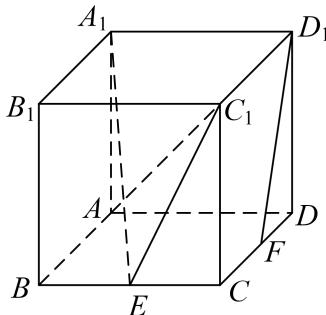
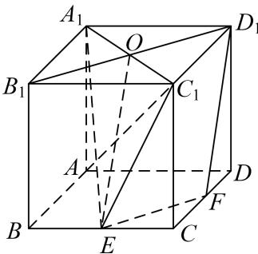
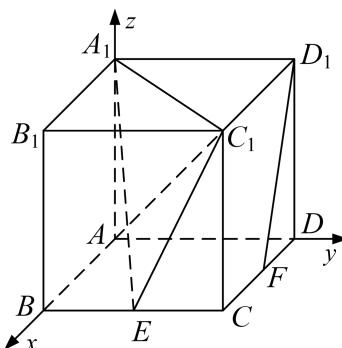

> [!faq]- 《专题12 利用空间向量计算空间角的综合问题-立体几何（理科）》例题解析
>
> > [!success]- **【答案】** 详见解析
>
> > [!note]- **【分析】**
> > 本题未单列分析。
>
> > [!note]- **【解析】**
> > (1)求证： $D_{1}F \parallel$ 平面 $A_{1}EC_{1}$ ;
> > (2)求直线 $AC_{1}$ 与平面 $A_{1}EC_{1}$ 所成的角的正弦值；
> > (3)求二面角 $A - A_{1}C_{1} - E$ 的正弦值.
> > 
> > 5. 解析 (1)如图所示, 连接 $A_{1}C_{1}$ , $B_{1}D_{1}$ 相交于 $O$ , 连接 $OE$ , $EF$ ,
> > 因为 E 为棱 BC 的中点，F 为棱 CD 的中点，所以 $EF \parallel B_{1}D_{1}$ 且 $EF = \frac{1}{2}B_{1}D_{1}$ .
> > 根据正方体有 $OD_{1}=\frac{1}{2}B_{1}D_{1}$ ，所以 $EF=OD_{1}$ .
> > 所以四边形 $OEFD_{1}$ 为平行四边形，所以 $OE \parallel D_{1}F$ ，
> > 又因为 $OE \subset$ 平面 $A_{1}EC_{1}$ ， $D_{1}F \notin$ 平面 $A_{1}EC_{1}$ ，所以 $D_{1}F \parallel$ 平面 $A_{1}EC_{1}$ .
> > 
> > (2) 以 A 为坐标原点，AB，AD， $AA_{1}$ 为坐标轴建立空间直角坐标系，如图所示则 $A(0, 0, 0)$ ， $C_{1}(2, 2, 2)$ ， $E(2, 1, 0)$ ， $A_{1}(0, 0, 2)$ ，
> > 则 $\overrightarrow{A_{1}E}=(2,1,-2)$ ， $\overrightarrow{E C_{1}}=(0,1,2)$ ， $\overrightarrow{A C_{1}}=(2,2,2)$ .
> > 设平面 $A_{1}EC_{1}$ 的法向量 $\boldsymbol{n}_{1}=(x_{1},y_{1},z_{1})$ ，则 $\left\{\begin{aligned}\boldsymbol{n}_{1}\cdot\overrightarrow{A_{1}}E=0,\\ \boldsymbol{n}_{1}\cdot\overrightarrow{EC_{1}}=0,\end{aligned}\right.$ 即 $\left\{\begin{aligned}2x_{1}+y_{1}-2z_{1}=0,\\ y_{1}+2z_{1}=0.\end{aligned}\right.$ 令 $z_{1}=1$ ，可得 $\boldsymbol{n}_{1}=(2,-2,1)$ .
> > 设直线 $AC_{1}$ 与平面 $A_{1}EC_{1}$ 所成的角为 $\theta$ ，则 $\sin\theta=|\cos<n_{1},\quad\overrightarrow{AC_{1}}>|=\frac{|n_{1}\cdot\overrightarrow{AC_{1}}|}{|n_{1}|\cdot|\overrightarrow{AC_{1}}|}=\frac{\sqrt{3}}{9}.$
> > 
> > (3)在(2)建立的空间直角坐标系中，设平面设平面 $A_{1}AC_{1}$ 的法向量 $\boldsymbol{n}_{2}=(x_{2},y_{2},z_{2})$ ,
> > 则 $\left\{ \begin{array}{l} n_{2} \cdot \overrightarrow{AA}_{1} = 0, \\ n_{2} \cdot \overrightarrow{AC}_{1} = 0, \end{array} \right.$ 即 $\left\{ \begin{array}{l} 2z_{2} = 0, \\ 2x_{2} + 2y_{2} + 2z_{2} = 0. \end{array} \right.$ 令 $y_{2} = 1$ ，可得 $n_{2} = (-1, 1, 0)$ .
> > 设直线 $AC_{1}$ 与平面 $A_{1}EC_{1}$ 所成的角为 $\theta$ ，则 $\sin\theta=|\cos<n_{1},\quad\overrightarrow{AC_{1}}>|=\frac{|n_{1}\cdot\overrightarrow{AC_{1}}|}{|n_{1}|\cdot|\overrightarrow{AC_{1}}|}=\frac{\sqrt{3}}{9}.$
> > 设二面角 $A-A_{1}C_{1}-E$ 为 $\alpha$ ，根据(2)有 $\cos\alpha=\frac{|n_{1}\cdot n_{2}|}{|n_{1}|\cdot|n_{2}|}=-\frac{2\sqrt{2}}{3}$ ，所以 $\sin\alpha=\frac{1}{3}$ .
