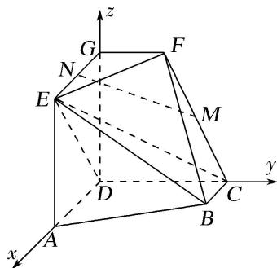

> [!faq]- 《专题12 利用空间向量计算空间角的综合问题-立体几何（理科）》例题解析
>
> > [!success]- **【答案】** 详见解析
>
> > [!note]- **【解析】**
> > 解析 依题意，可以建立以 D 为原点，分别以 $\overrightarrow{DA}, \overrightarrow{DC}, \overrightarrow{DG}$ 的方向为 x 轴，y 轴，z 轴的正方向的空间直角坐标系(如图)，可得 $D(0, 0, 0)$ ， $A(2, 0, 0)$ ， $B(1, 2, 0)$ ， $C(0, 2, 0)$ ， $E(2, 0, 2)$ ， $F(0, 1, 2)$ ， $G(0, 0, 2)$ ， $M\left\{0, \frac{3}{2}, 1\right\}$ ， $N(1, 0, 2)$ .
> >
> > 
> >
> > (1)依题意 $\overrightarrow{DC}=(0,2,0)$ ， $\overrightarrow{DE}=(2,0,2)$ .设 $n_{0}=(x,y,z)$ 为平面CDE的法向量，
> >
> > 则 $\left\{ \begin{array}{l} n_0 \cdot \overrightarrow{DC} = 0 \\ n_0 \cdot \overrightarrow{DE} = 0, \end{array} \right.$ 即 $\left\{ \begin{array}{l} 2y = 0, \\ 2x + 2z = 0, \end{array} \right.$ 不妨令 $z = -1$ ，可得 $n_0 = (1, 0, -1)$ .
> >
> > 又 $\overrightarrow{MN}=\left(1,-\frac{3}{2},1\right)$ ，可得 $\overrightarrow{MN}\cdot n_{0}=0$ ，又因为直线 $MN\notin$ 平面CDE，所以 $MN//$ 平面CDE.
> >
> > (2)依题意，可得 $\overrightarrow{BC}=(-1,0,0)$ ， $\overrightarrow{BE}=(1,-2,2)$ ， $\overrightarrow{CF}=(0,-1,2)$ .
> >
> > 设 $\boldsymbol{n}=(x,y,z)$ 为平面 BCE 的法向量，则 $\left\{\begin{aligned}\boldsymbol{n}\cdot\overrightarrow{BC}&=0,\\ \boldsymbol{n}\cdot\overrightarrow{BE}&=0,\end{aligned}\right.$ 即 $\left\{\begin{aligned}-x&=0,\\ x&-2y+2z&=0,\end{aligned}\right.$
> >
> > 不妨令 z=1，可得 $n=(0,1,1)$ .
> >
> > 设 $\boldsymbol{m}=(x,y,z)$ 为平面 BCF 的法向量，则 $\left\{\begin{aligned}\boldsymbol{m}\cdot\overrightarrow{BC}&=0,\\ \boldsymbol{m}\cdot\overrightarrow{CF}&=0,\end{aligned}\right.$ 即 $\left\{\begin{aligned}-x&=0,\\ -y&+2z&=0,\end{aligned}\right.$
> >
> > 不妨令 z=1，可得 $m=(0,2,1)$ .
> >
> > 因此有 $\cos<m,\quad n>=\frac{m\cdot n}{|m||n|}=\frac{3\sqrt{10}}{10}$ ，于是 $\sin<m,\quad n>=\frac{\sqrt{10}}{10}$ .
> >
> > 所以，二面角 E-BC-F 的正弦值为 $\frac{\sqrt{10}}{10}$ .
> >
> > (3)设线段 DP 的长为 $h(h \in [0, 2])$ ，则点 P 的坐标为 $(0, 0, h)$ ，可得 $\overrightarrow{BP}=(-1, -2, h)$ .
> >
> > 易知， $\overrightarrow{DC} = (0, 2, 0)$ 为平面 $ADGE$ 的一个法向量，故 $\left|\cos < \overrightarrow{BP}, \overrightarrow{DC} > \right| = \frac{\left|\overrightarrow{BP} \cdot \overrightarrow{DC}\right|}{\left|\overrightarrow{BP}\right| \left|\overrightarrow{DC}\right|} = \frac{2}{\sqrt{h^2 + 5}}$ 由题意，可得 $\frac{2}{\sqrt{h^2 + 5}} = \sin 60^\circ = \frac{\sqrt{3}}{2}$ ，解得 $h = \frac{\sqrt{3}}{3} \in [0, 2]$ . 所以，线段 $DP$ 的长为 $\frac{\sqrt{3}}{3}$ .
