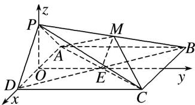

> [!faq]- 《专题12 利用空间向量计算空间角的综合问题-立体几何（理科）》例题解析
>
> > [!success]- **【答案】** C
>
> > [!note]- **【解析】**
> > 解析
> > (1)如图, 设 $AC$ , $BD$ 的交点为 $E$ , 连接 $ME$ .
> >
> > 
> >
> > ∵PD∥平面 MAC， $PD \subset$ 平面 PDB，平面 $MAC \cap$ 平面 PDB = ME，
> >
> > ∴PD//ME. ∵四边形ABCD是正方形，∴E为BD的中点．∴M为PB的中点.
> >
> > (2)取 AD 的中点 O，连接 OP，OE. $\because PA=PD,\therefore OP\perp AD.$
> >
> > 又∵平面 PAD⊥平面 ABCD，平面 PAD∩平面 ABCD=AD，OP⊂平面 PAD，∴OP⊥平面 ABCD.
> >
> > ∵OE⊂平面ABCD，∴OP⊥OE. ∵底面ABCD是正方形，∴OE⊥AD.
> >
> > 以 O 为原点，分别以 $\overrightarrow{OD}, \overrightarrow{OE}, \overrightarrow{OP}$ 为 x 轴，y 轴，z 轴的正方向建立如图所示的空间直角坐标系 Oxyz，
> >
> > $$
> > P (0, 0, \sqrt {2}), D (2, 0, 0), B (- 2, 4, 0), \overrightarrow {B D} = (4, - 4, 0), \overrightarrow {P D} = (2, 0, - \sqrt {2}).
> > $$
> >
> > 设平面 BDP 的一个法向量为 $\boldsymbol{n}=(x,y,z)$ ,
> >
> > 则 $\left\{ \begin{array}{l} n \cdot \overrightarrow{BD} = 0, \\ n \cdot \overrightarrow{PD} = 0, \end{array} \right.$ 即 $\left\{ \begin{array}{l} 4x - 4y = 0, \\ 2x - \sqrt{2}z = 0. \end{array} \right.$ 令 $x = 1$ ，得 $y = 1$ ， $z = \sqrt{2}$ 。于是 $n = (1, 1, \sqrt{2})$
> >
> > 又平面 PAD 的一个法向量为 $p=(0,1,0)$ ,
> >
> > ∴ $\cos <n,\ p>=\frac{n\cdot p}{|n||p|}=\frac{1}{2}.$ ∴ 平面 BPD 与平面 APD 的夹角为 $60^{\circ}.$
> >
> > (3)由
> > (1)
> > (2)知 $M\left[-1, 2, \frac{\sqrt{2}}{2}\right]$ , $C(2, 4, 0)$ , 则 $\overrightarrow{MC} = \left[3, 2, -\frac{\sqrt{2}}{2}\right]$ .
> >
> > 设直线 $MC$ 与平面 $BDP$ 所成角为 $\alpha$ ，则 $\sin \alpha = |\cos < n, \vec{MC} >| = \frac{|\boldsymbol{n} \cdot \vec{MC}|}{|\boldsymbol{n}||\vec{MC}|} = \frac{2\sqrt{6}}{9}$ .
> >
> > ∴直线 MC 与平面 BDP 所成角的正弦值为 $\frac{2\sqrt{6}}{9}$ .
