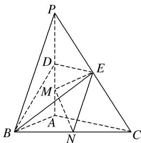
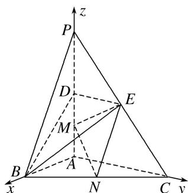

> [!faq]- 《专题12 利用空间向量计算空间角的综合问题-立体几何（理科）》例题解析
>
> > [!success]- **【答案】** 详见解析
>
> > [!note]- **【分析】**
> > 本题未单列分析。
>
> > [!note]- **【解析】**
> > (1)求证： $MN / /$ 平面BDE；
> >
> > (2)求二面角 C-EM-N 的正弦值;
> >
> > (3)已知点 $H$ 在棱 $PA$ 上，且直线 $NH$ 与直线 $BE$ 所成角的余弦值为 $\frac{\sqrt{7}}{21}$ ，求线段 $AH$ 的长.
> >
> > 
> >
> > 6. 解析
> > (1)如图，以 \(A\) 为原点，分别以 \(AB, AC, AP\) 所在直线为 \(x\) 轴，\(y\) 轴，\(z\) 轴，建立空间直角坐标系。由题意，可得 \(A(0, 0, 0), B(2, 0, 0), C(0, 4, 0), P(0, 0, 4), D(0, 0, 2), E(0, 2, 2), M(0, 0, 1), N(1, 2, 0). \(\overrightarrow{DE} = (0, 2, 0), \overrightarrow{DB} = (2, 0, -2)\).
> >
> > 设 $n=(x,y,z)$ 为平面 BDE 的一个法向量，则 $\left\{\begin{aligned}n\cdot\overrightarrow{DE}&=0,\\ n\cdot\overrightarrow{DB}&=0,\end{aligned}\right.$ 即 $\left\{\begin{aligned}2y&=0,\\ 2x-2z&=0.\end{aligned}\right.$ 不妨设 z=1，
> > 可得 $n=(1,0,1)$ . 又 $\overrightarrow{MN}=(1,2,-1)$ ，可得 $\overrightarrow{MN}\cdot n=0$ .
> > 因为 MN∉平面 BDE，所以 MN// 平面 BDE.
> >
> > 
> >
> > (2) 易知 $n_{1}=(1,0,0)$ 为平面 CEM 的一个法向量.
> >
> > 设 $\boldsymbol{n}_{2}=(x_{1},y_{1},z_{1})$ 为平面 EMN 的一个法向量，则 $\left\{\begin{aligned}\boldsymbol{n}_{2}\cdot\overrightarrow{EM}&=0,\\ \boldsymbol{n}_{2}\cdot\overrightarrow{MN}&=0,\end{aligned}\right.$
> >
> > 因为 $\overrightarrow{EM}=(0,-2,-1)$ ， $\overrightarrow{MN}=(1,2,-1)$ ，所以 $\begin{cases}-2y_{1}-z_{1}=0,\\x_{1}+2y_{1}-z_{1}=0.\end{cases}$
> >
> > 不妨设 $y_{1}=1$ ，可得 $n_{2}=(-4,1,-2)$ .
> >
> > 因此 $\cos<n_{1},\quad n_{2}>=\frac{n_{1}\cdot n_{2}}{|n_{1}||n_{2}|}=-\frac{4}{\sqrt{21}}$ ，于是 $\sin<n_{1},\quad n_{2}>=\frac{\sqrt{105}}{21}$ .
> >
> > 所以二面角 C-EM-N 的正弦值为 $\frac{\sqrt{105}}{21}$ .
> >
> > (3)由题意，设 $AH=h(0\leq h\leq4)$ ，则 $H(0,0,h)$ ，进而可得 $\overrightarrow{NH}=(-1,-2,h)$ ， $\overrightarrow{BE}=(-2,2,2)$ .
> >
> > 由已知，得 $|\cos < \overrightarrow{NH}, \overrightarrow{BE} >| = \frac{|\overrightarrow{NH} \cdot \overrightarrow{BE}|}{|\overrightarrow{NH}||\overrightarrow{BE}|} = \frac{|2h - 2|}{\sqrt{h^2 + 5} \times 2\sqrt{3}} = \frac{\sqrt{7}}{21}$ ,
> >
> > 整理得 $10h^{2}-21h+8=0$ ，解得 $h=\frac{8}{5}$ 或 $h=\frac{1}{2}$ 。所以线段 AH 的长为 $\frac{8}{5}$ 或 $\frac{1}{2}$ 。
