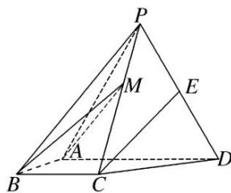

<!-- question-source:start -->
[例 1] (2017·全国Ⅱ)如图，四棱锥 P-ABCD 中，侧面 PAD 为等边三角形且垂直于底面 ABCD，AB = BC = $\frac{1}{2}$ AD， $\angle BAD = \angle ABC = 90^{\circ}$ ，E 是 PD 的中点.

(1)证明：直线 $CE \parallel$ 平面 $PAB$ ;

(2)点 M 在棱 PC 上，且直线 BM 与底面 ABCD 所成角为 $45^{\circ}$ ，求二面角 M-AB-D 的余弦值.

(1)取 $PA$ 的中点 $F$ , 连接 $EF$ , $BF$ . 因为 $E$ 是 $PD$ 的中点, 所以 $EF \parallel AD$ , $EF = \frac{1}{2} AD$ .

由 $\angle BAD = \angle ABC = 90^{\circ}$ ，得 $BC / / AD$ ，又 $BC = \frac{1}{2} AD$

所以 $EF \parallel BC$ ，四边形 BCEF 是平行四边形，CE // BF，

又 $BF \subset$ 平面 PAB， $CE \notin$ 平面 PAB，故 CE // 平面 PAB.

(2)由已知得 $BA \perp AD$ ，以 $A$ 为坐标原点， $AB$ ， $AD$ 所在直线分别为 $x$ 轴， $y$ 轴， $|\overrightarrow{AB}|$ 为单位长度，建立如图所示的空间直角坐标系 $Axyz$ ，则 $A(0, 0, 0)$ ， $B(1, 0, 0)$ ， $C(1, 1, 0)$ ， $P(0, 1, \sqrt{3})$ ， $\overrightarrow{PC} = (1, 0, -\sqrt{3})$ ， $\overrightarrow{AB} = (1, 0, 0)$ .

设 $M(x, y, z)(0<x<1)$ ，则 $\overrightarrow{BM}=(x-1, y, z)$ ， $\overrightarrow{PM}=(x, y-1, z-\sqrt{3})$ .

因为 BM 与底面 ABCD 所成的角为 $45^{\circ}$ ，而 $n=(0,0,1)$ 是底面 ABCD 的法向量，

所以 $|\cos < \overrightarrow{BM}, n >| = \sin 45^\circ \frac{|z|}{\sqrt{(x - 1)^2 + y^2 + z^2}} = \frac{\sqrt{2}}{2}$ ，即 $(x - 1)^2 + y^2 - z^2 = 0$ 。①

又 M 在棱 PC 上，设 $\overrightarrow{PM} = \lambda \overrightarrow{PC}$ ，则 $x = \lambda, y = 1, z = \sqrt{3} - \sqrt{3}\lambda.$ ②

由①②解得 $\left\{\begin{aligned}x&=1+\frac{\sqrt{2}}{2},\\ y&=1,\\ z&=-\frac{\sqrt{6}}{2}\end{aligned}\right.$ (舍去)或 $\left\{\begin{aligned}x&=1-\frac{\sqrt{2}}{2},\\ y&=1,\\ z&=\frac{\sqrt{6}}{2},\end{aligned}\right.$

所以 $M\left(1-\frac{\sqrt{2}}{2},1,\frac{\sqrt{6}}{2}\right)$ ，从而 $\overrightarrow{AM}=\left(1-\frac{\sqrt{2}}{2},1,\frac{\sqrt{6}}{2}\right)$ .

设 $\boldsymbol{m}=(x_{0},y_{0},z_{0})$ 是平面 ABM 的法向量，则 $\left\{\begin{aligned}\boldsymbol{m}\cdot\overrightarrow{AM}&=0,\\ \boldsymbol{m}\cdot\overrightarrow{AB}&=0,\end{aligned}\right.$ 即 $\left\{\begin{aligned}(2-\sqrt{2})x_{0}+2y_{0}+\sqrt{6}z_{0}&=0,\\ x_{0}&=0,\end{aligned}\right.$

所以可取 $m=(0,-\sqrt{6},2)$ . 于是 $\cos<m,n>=\frac{m\cdot n}{|m||n|}=\frac{\sqrt{10}}{5}$ .

由图可知二面角 M—AB—D 是锐角，所以二面角 M—AB—D 的余弦值为 $\frac{\sqrt{10}}{5}$ .
<!-- question-source:end -->

![[高中/总复习/专题/立体几何/专题12 利用空间向量计算空间角的综合问题-立体几何（理科）/考点02_已知某一空间角求另一空间角/例题/answers/Q00043793A1.md]]
