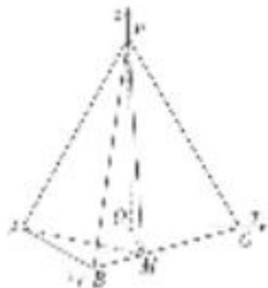

<!-- question-source:start -->
(1)因为 $PA = PC = AC = 4$ ， $O$ 为 $AC$ 的中点，所以 $PO \perp AC$ ，且 $PO = 2\sqrt{3}$

连接 OB．因为 $AB=BC=\frac{\sqrt{2}}{2}AC$ ，所以 $\triangle ABC$ 为等腰直角三角形，且 $OB\perp AC$ ， $OB=\frac{1}{2}AC=2$ .

由 $PO^{2}+OB^{2}=PB^{2}$ ，知 $PO \perp OB$ .

由 $PO \perp OB$ ， $PO \perp AC$ ， $AC \cap OB = O$ ，知 $PO \perp$ 平面 ABC.

(2)如图，以 O 为坐标原点， $\overrightarrow{OB},\overrightarrow{OC},\overrightarrow{OP}$ 的方向分别为 x 轴、y 轴、z 轴正方向，建立如图所示的空间直角坐标系 Oxyz.

由已知得 $O(0, 0, 0)$ ， $B(2, 0, 0)$ ， $A(0, -2, 0)$ ， $C(0, 2, 0)$ ， $P(0, 0, 2\sqrt{3})$ ，

则 $\overrightarrow{AP} = (0, 2, 2\sqrt{3})$ ，取平面 $PAC$ 的一个法向量 $\overrightarrow{OB} = (2, 0, 0)$ .

设 $M(a, 2-a, 0)(0<a\leqslant2)$ ，则 $\overrightarrow{AM}=(a, 4-a, 0)$ .

设平面 PAM 的法向量为 $\boldsymbol{n}=(x,y,z)$ .

由 $\left\{\begin{aligned}\overrightarrow{AP}\cdot n&=0,\\ \overrightarrow{AM}\cdot n&=0,\end{aligned}\right.$ 得 $\left\{\begin{aligned}2y+2\sqrt{3}z&=0,\\ ax+(4-a)y&=0,\end{aligned}\right.$ 可取 $n=(\sqrt{3}(a-4),\sqrt{3}a,-a),$

所以 $\cos<\overrightarrow{OB},\quad n>=\frac{2\sqrt{3}(a-4)}{2\sqrt{3(a-4)^{2}+3a^{2}+a^{2}}}$ .

由已知得 $|\cos < \overrightarrow{OB}, n > | = \frac{\sqrt{3}}{2}$ . 所以 $\frac{2\sqrt{3}|a - 4|}{2\sqrt{3(a - 4)^2 + 3a^2 + a^2}} = \frac{\sqrt{3}}{2}$ .
<!-- question-source:end -->

![[高中/总复习/专题/立体几何/专题12 利用空间向量计算空间角的综合问题-立体几何（理科）/考点02_已知某一空间角求另一空间角/例题/answers/Q00043796A1.md]]
