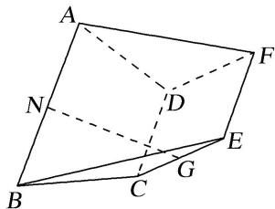

<!-- question-source:start -->
(1)求证： $NG \parallel$ 平面 ADF;

(2)设二面角 $A - CD - F$ 的大小为 $\theta \left(\frac{\pi}{2} < \theta < \pi\right)$ ，当 $\theta$ 为何值时，二面角 $A - BC - E$ 的余弦值为 $\frac{\sqrt{13}}{13}$ ?

<!-- question-source:end -->

![[高中/总复习/专题/立体几何/专题12 利用空间向量计算空间角的综合问题-立体几何（理科）/考点02_已知某一空间角求另一空间角/例题/answers/Q00043797A1.md]]
