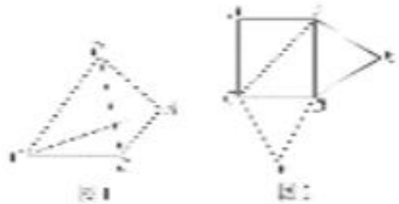
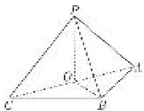
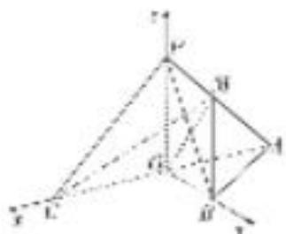

> [!faq]- 《专题12 利用空间向量计算空间角的综合问题-立体几何（理科）》例题解析
>
> > [!success]- **【答案】** 详见解析
>
> > [!note]- **【分析】**
> > 本题未单列分析。
>
> > [!note]- **【解析】**
> > (1)证明：平面 PAC⊥平面 ABC;
> > (2)若点 M 在棱 PA 上运动，当直线 BM 与平面 PAC 所成的角最大时，求二面角 P-BC-M 的余弦值.
> > 
> > 解析 (1)如图，设 AC 的中点为 O，连接 OB，OP.
> > 由题意，得 PA=PB=PC= $\sqrt{2}$ ，OP=OB=1。
> > 因为在 $\triangle POB$ 中， $OP^{2}+OB^{2}=PB^{2}$ ，所以 $OP\perp OB$ .
> > 因为在 $\triangle PAC$ 中，PA=PC，O为AC的中点，所以 $OP\perp AC$ .
> > 因为 $AC \cap OB = O$ ， $AC \subset$ 平面 ABC， $OB \subset$ 平面 ABC，所以 $OP \perp$ 平面 ABC.
> > 因为 $OP \subset$ 平面 PAC，所以平面 $PAC \perp$ 平面 ABC.
> > 
> > (2)由(1)知， $OB \perp OP$ ，由题意可得 $OB \perp AC$ ，所以 $OB \perp$ 平面 PAC，
> > 所以 $\angle BMO$ 是直线 BM 与平面 PAC 所成的角，且 $\tan\angle BMO=\frac{OB}{OM}=\frac{1}{OM}$ ,
> > 所以当线段 OM 最短，即 M 是 PA 的中点时， $\angle BMO$ 最大.
> > 
> > 由 $OP \perp$ 平面 ABC， $OB \perp AC$ ，得 $OP \perp OB$ ， $OP \perp OC$ ， $OB \perp OC$ ，以 O 为坐标原点，OC，OB，OP 所在的直线分别为 x 轴、y 轴、z 轴，建立如图所示的空间直角坐标系，
> > 则 $O(0, 0, 0), C(1, 0, 0), B(0, 1, 0), A(-1, 0, 0), P(0, 0, 1), M\left[-\frac{1}{2}, 0, \frac{1}{2}\right]$ ,
> > $\overrightarrow{BC}=(1,-1,0),\overrightarrow{PC}=(1,0,-1),\overrightarrow{MC}=\left(\frac{3}{2},0,-\frac{1}{2}\right).$
> > 设平面 MBC 的法向量为 $\boldsymbol{m}=(x_{1},y_{1},z_{1})$ ，由 $\left\{\begin{aligned}\boldsymbol{m}\cdot\overrightarrow{BC}&=0,\\ \boldsymbol{m}\cdot\overrightarrow{MC}&=0,\end{aligned}\right.$ 得 $\left\{\begin{aligned}x_{1}-y_{1}&=0,\\ 3x_{1}-z_{1}&=0,\end{aligned}\right.$
> > 令 $x_{1}=1$ ，得 $y_{1}=1,\quad z_{1}=3$ ，即 $m=(1,1,3)$ 是平面 MBC 的一个法向量.
> > 设平面 PBC 的法向量为 $\boldsymbol{n}=(x_{2}, y_{2}, z_{2})$ ，由 $\left\{\begin{aligned}\boldsymbol{n}\cdot\overrightarrow{BC}&=0,\\ \boldsymbol{n}\cdot\overrightarrow{PC}&=0,\end{aligned}\right.$ 得 $\left\{\begin{aligned}x_{2}-y_{2}&=0,\\ x_{2}-z_{2}&=0,\end{aligned}\right.$
> > 令 $x_{2}=1$ ，得 $y_{2}=1,\quad z_{2}=1$ ，即 $n=(1,1,1)$ 是平面 PBC 的一个法向量.
> > 所以 $\cos<m,\quad n>=\frac{m\cdot n}{|m||n|}=\frac{5}{\sqrt{33}}=\frac{5\sqrt{33}}{33}.$
> > 结合图可知，二面角 P-BC-M 的余弦值为 $\frac{5\sqrt{33}}{33}$ .
