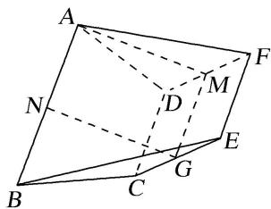
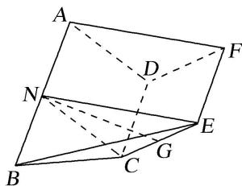
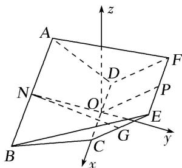

> [!faq]- 《专题12 利用空间向量计算空间角的综合问题-立体几何（理科）》例题解析
>
> > [!success]- **【答案】** 详见解析
>
> > [!note]- **【分析】**
> > 本题未单列分析。
>
> > [!note]- **【解析】**
> > (1)求证： $NG \parallel$ 平面 ADF;
> > (2)设二面角 $A - CD - F$ 的大小为 $\theta \left(\frac{\pi}{2} < \theta < \pi\right)$ ，当 $\theta$ 为何值时，二面角 $A - BC - E$ 的余弦值为 $\frac{\sqrt{13}}{13}$ ?
> > 
> > 解析 (1)法一 如图，设 $DF$ 的中点为 $M$ ，连接 $AM$ ， $GM$
> > 
> > 因为四边形 DCEF 是正方形，所以 $MG \parallel CD$ ，
> > 又四边形 ABCD 是梯形，且 AB=2CD， $AB \parallel CD$ ，点 N 是 AB 的中点，
> > 所以 $AN \parallel DC$ ，所以 $MG \parallel AN$ ，所以四边形 ANGM 是平行四边形，所以 $NG \parallel AM$ .
> > 又 $AM \subset$ 平面 ADF， $NG \notin$ 平面 ADF，所以 $NG \parallel$ 平面 ADF.
> > 法二 如图，连接 NC, NE,
> > 
> > 因为 N 是 AB 的中点，四边形 ABCD 是梯形，AB = 2CD， $AB \parallel CD$ ，
> > 所以 AN 繣 CD，所以四边形 ANCD 是平行四边形，所以 NC // AD，
> > 因为 $AD \subset$ 平面 ADF， $NC \notin$ 平面 ADF，所以 $NC \parallel$ 平面 ADF，
> > 同理可得 $NE \parallel$ 平面 $ADF$ , 又 $NC \cap NE = N$ , 所以平面 $NCE \parallel$ 平面 $ADF$ ,
> > 因为 $NG \subset$ 平面 $NCE$ ，所以 $NG \parallel$ 平面 $ADF$ .
> > (2)设 $CD$ 的中点为 $O$ , $EF$ 的中点为 $P$ , 连接 $NO$ , $OP$ , 易得 $NO \perp CD$ , 以点 $O$ 为原点, 以 $OC$ 所在直线为 $x$ 轴, 以 $NO$ 所在直线为 $y$ 轴, 以过点 $O$ 且与平面 $ABCD$ 垂直的直线为 $z$ 轴建立如图所示的空间直角坐标系.
> > 
> > 因为 $NO \perp CD$ ， $OP \perp CD$ ，所以 $\angle NOP$ 是二面角 A-CD-F 的平面角，
> > 则 $\angle NOP = \theta$ ，所以 $\angle POy = \pi - \theta$ ，设 AB = 4，则 BC = CD = 2，
> > 则 $P(0, 2\cos(\pi-\theta), 2\sin(\pi-\theta))$ , $E(1, 2\cos(\pi-\theta), 2\sin(\pi-\theta))$ , $C(1, 0, 0)$ , $B(2, -\sqrt{3}, 0)$ , $\overrightarrow{CE}=(0,\quad2\cos(\pi-\theta),\quad2\sin(\pi-\theta)),\quad\overrightarrow{CB}=(1,-\sqrt{3},0)$
> > 设平面 BCE 的法向量为 $\boldsymbol{n}=(x,y,z)$ ，则 $\left\{\begin{aligned}\boldsymbol{n}\cdot\overrightarrow{CB}&=0,\\ \boldsymbol{n}\cdot\overrightarrow{CE}&=0,\end{aligned}\right.$ 即 $\left\{\begin{aligned}x-\sqrt{3}y&=0,\\ 2y\cos(\pi-\theta)+2z\sin(\pi-\theta)&=0,\end{aligned}\right.$
> > 因为 $\theta \in \left(\frac{\pi}{2},\pi\right)$ ，所以 $\cos (\pi -\theta)\neq 0$ ，令 $z = 1$ ，则 $y = -\tan (\pi -\theta),x = -\sqrt{3}\tan (\pi -\theta),$
> > 所以 $n=(-\sqrt{3}\tan(\pi-\theta), -\tan(\pi-\theta), 1)$ 为平面 BCE 的一个法向量，
> > 又易知平面 ACD 的一个法向量为 $m=(0,0,1)$ ,
> > 所以 $\cos<m,\quad n>=\frac{m\cdot n}{|m|\cdot|n|}=\frac{1}{\sqrt{4\tan^{2}(\pi-\theta)+1}}$
> > 由图可知二面角 A-BC-E 为锐角，所以 $\frac{1}{\sqrt{4\tan^{2}(\pi-\theta)+1}}=\frac{\sqrt{13}}{13}$ ,
> > 解得 $\tan^2 (\pi -\theta) = 3$ ，又 $\frac{\pi}{2} <  \theta <  \pi$ ，所以 $\tan (\pi -\theta) = \sqrt{3}$ ，即 $\pi -\theta = \frac{\pi}{3}$ 得 $\theta = \frac{2\pi}{3}$
> > 所以当二面角 A-CD-F 的大小为 $\frac{2\pi}{3}$ 时，二面角 A-BC-E 的余弦值为 $\frac{\sqrt{13}}{13}$ .
> > 【对点训练】
