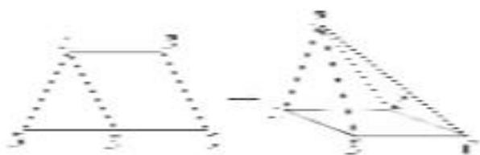

<!-- question-source:start -->
4. 如图，等腰梯形 $ABCD$ 中， $AB \parallel CD$ ， $AD = AB = BC = 1$ ， $CD = 2$ ， $E$ 为 $CD$ 的中点，以 $AE$ 为折痕把 $\triangle ADE$ 折起，使点 $D$ 到达点 $P$ 的位置 ( $P \notin$ 平面 $ABCE$ ).

(1)证明： $AE \perp PB;$

(2)若直线 $PB$ 与平面 $ABCE$ 所成的角为 $\frac{\pi}{4}$ ，求二面角 $A - PE - C$ 的余弦值.

<!-- question-source:end -->

![[高中/总复习/专题/立体几何/专题12 利用空间向量计算空间角的综合问题-立体几何（理科）/考点02_已知某一空间角求另一空间角/对点训练/answers/Q00043802A1.md]]
