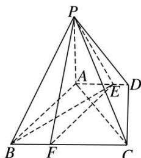

<!-- question-source:start -->
5. 如图，在四棱锥 $P - ABCD$ 中， $PA \perp$ 底面 $ABCD$ ，底面 $ABCD$ 是直角梯形， $\angle ADC = 90^\circ$ ， $AD \parallel BC$ ， $AB \perp AC$ ， $AB = AC = \sqrt{2}$ ，点 $E$ 在 $AD$ 上，且 $AE = 2ED$ .

(1)已知点 F 在 BC 上，且 CF=2FB，求证：平面 $PEF \perp$ 平面 PAC；

(2)当二面角 A—PB—E 的余弦值为多少时，直线 PC 与平面 PAB 所成的角为 $45^{\circ}$ ?

<!-- question-source:end -->

![[高中/总复习/专题/立体几何/专题12 利用空间向量计算空间角的综合问题-立体几何（理科）/考点02_已知某一空间角求另一空间角/对点训练/answers/Q00043803A1.md]]
